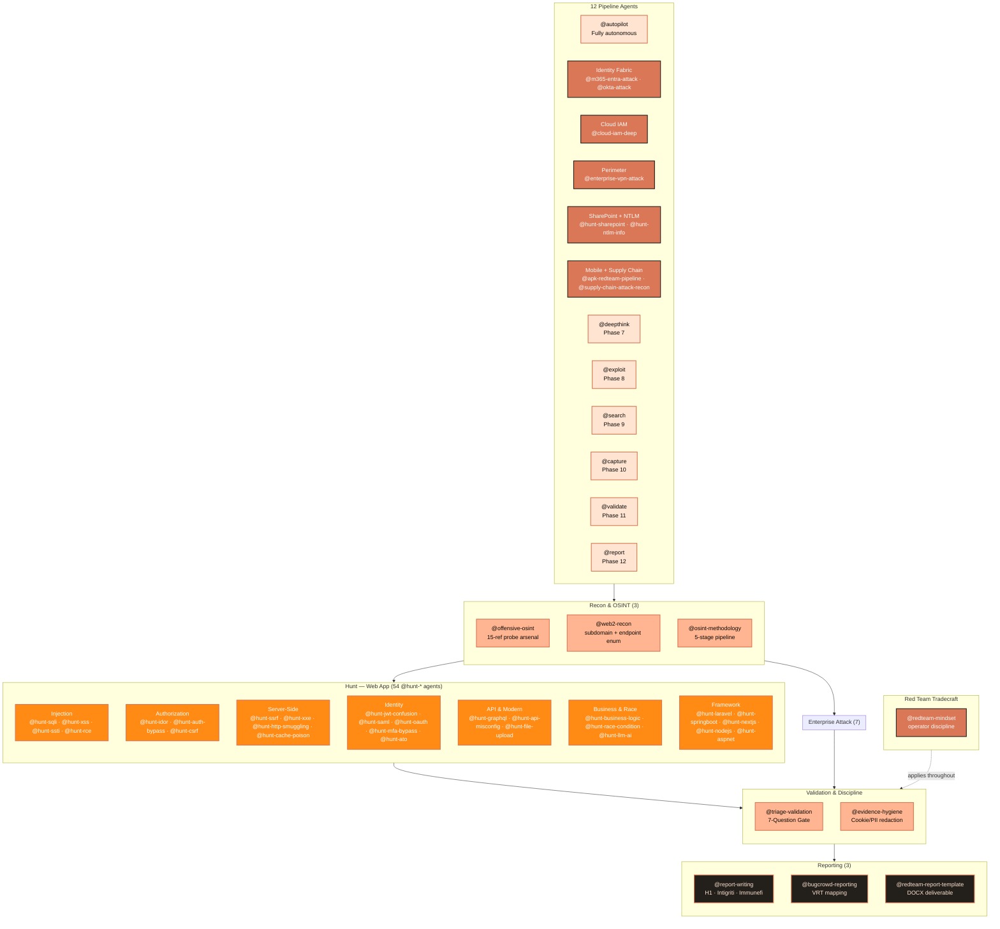

<h1 align="center">
  <br>
  <a href="https://github.com/manojxshrestha/dristi">
    
  </a>
  <br>
  Dristi
  <br>
</h1>

<h4 align="center">Offensive security - OWASP WSTG knowledge base as an MCP server + vulnerability hunting agents</h4>

<p align="center">
  
  
  
  
  
  
  
</p>

<p align="center">
  Dristi is a self-contained OpenCode agent bundle + WSTG MCP server for bug hunting,
  external red-team work, and authorized pentests — <b>87 agents</b> · <b>89 MCP tools</b> ·
  OWASP WSTG v4.2 methodology across 25 vulnerability classes ·
  enterprise identity + infrastructure attack matrices ·
  engagement management · Burp MCP integration ·
  <b>20 GF patterns</b> for parameter discovery.
</p>

---

## What is this?

Dristi is an LLM-powered security toolkit that provides the complete OWASP Web Security Testing Guide methodology as an MCP server — 96 test cases across 12 categories, and the full pentest lifecycle. It pairs with Burp Suite's MCP server for request execution, or runs standalone as a reference knowledge base.

Four layers stack:

- **Methodology + agents** — *how to think.* 12-phase pipeline (scope→auth→intel→recon→surface→hunt→deepthink→exploit→search→capture→validate→report), critical-thinking framework, developer-psychology heuristics, anomaly detection patterns, and the red-team operator-discipline corrections (when scope is "external red team" not "bug hunting / WAPT"). Available as auto-loading OpenCode agents.
- **54 `@hunt-*` agents** — *what to look for in webapps.* Per-class detection patterns, payloads, bypass tables, and chain templates — curated from OWASP WSTG v4.2 methodology across 25 vulnerability classes, plus 20+ framework/surface skills (Next.js, Spring Boot, Laravel, Kubernetes, CI/CD, WebSocket, deserialization, ...).
- **Credential-attack pipeline** — *password spray as a parallel branch to web vuln hunting.* 4-stage pipeline: company-specific wordlist generation (cewler + hashcat rules) → HIBP k-anonymity breach ranking → OSINT employee discovery (theHarvester + username-anarchy) → low-rate spray (http-form / oauth / o365 / okta). Legal guardrails, lockout math, and spray → authenticated hunt chain template.
- **Enterprise platform attack chains** — *what to look for on the perimeter.* M365/Entra ID, Okta, cloud IAM, VMware vCenter, enterprise VPN, SharePoint, ASP.NET, NTLM, APK red-team pipeline, supply-chain recon — current CVE chains, AADSTS error references, version-fingerprint matrices, and post-credential escalation paths.
- **Validation + reporting** — *how to ship it.* 7-Question Gate, VRT category fallback, severity-request paragraphs, OOS rebuttals, cookie/PII redaction, client-facing red-team deliverable format, and SOC-patch / mid-engagement attacker detection methodology.

All triggered automatically by topic — describe what you're testing in plain English and the relevant agent loads. No invocation by name.

---

## Scope — what this bundle is for, and what it isn't

This bundle covers the **external attack surface** — anything reachable from the internet without first compromising an internal endpoint.

### In scope

- **Bug bounty hunting** — web apps, APIs, SaaS, GraphQL, OAuth, JWT, file upload, IDOR, SSRF, RCE chains
- **Web application pentesting** — full hunt-* coverage of OWASP-mapped bug classes + discipline rules
- **External red-team engagements** — initial-access against internet-facing enterprise estate: M365 / Entra ID, Okta-as-IdP, SharePoint on-prem (ToolShell + legacy SOAP), VMware vCenter / Workspace ONE, SSL VPN appliances (Cisco / Fortinet / Citrix / Palo Alto / Pulse / SonicWall / F5), Android APK red-team, supply-chain recon
- **Cloud misconfig + post-credential escalation** — public S3, IMDS chains, STS AssumeRole, cross-account confused-deputy
- **Recon + OSINT** — subdomain enum, identity-fabric mapping, certificate transparency, JS analysis, secret scanning
- **Reporting** — H1, Bugcrowd (VRT-aware), Intigriti, Immunefi, plus client-facing red-team deliverable format

### Out of scope (deliberate — not gaps, design decisions)

- **Internal Active Directory attacks** — BloodHound, Kerberoasting, ASREProast, DCSync, Pass-the-Hash, AD CS abuse, ntlmrelayx, Responder, PetitPotam, etc. Different operational risk profile; needs different tooling and judgment.
- **C2 frameworks** — Cobalt Strike, Sliver, Mythic, Havoc, BRC4 tradecraft.
- **Post-exploit / persistence / lateral** — Mimikatz/comsvcs LSASS dumping, golden/silver tickets, named-pipe impersonation, registry/scheduled-task/WMI-event/COM-hijacking persistence, token theft.
- **Evasion** — AMSI bypass, ETW patching, AV/EDR bypass.
- **iOS pentesting / hardware / RF / ICS/SCADA** — out of scope by design.
- **Binary exploitation / kernel pwn / browser internals** — different skill universe.

If you're running an internal red team that includes domain-takeover chains via Kerberos or lateral movement, this bundle won't help you in those phases — coverage for internal AD and post-exploit may come in a future update.

---

## Capability Map

87 agents group into 12 pipeline agents + 54 `@hunt-*` + 21 specialty agents. Agents auto-load when their description keywords match what you're describing to OpenCode.

> **OpenCode vs Dristi:** `/plan` and `/build` are OpenCode's built-in modes. Dristi adds 12 pipeline phases below — invoke via `@agent-name` or let `@autopilot`/`@consult` run them sequentially.

| # | Phase | Agent | What it does |
|---|-------|-------|-------------|
| 1 | **SCOPE** | `@scope` | Register target, scope boundaries, credentials |
| 2 | **AUTH** | (autopilot) | Get tokens/cookies, detect WAF |
| 3 | **INTEL** | `@pintel` | Passive OSINT: WHOIS, M365, cloud, spoof |
| 4 | **RECON** | `@recon` | Subdomains, crawl, params, nuclei, secrets |
| 5 | **SURFACE** | `@surface` | Classify endpoints, prioritize attack surface |
| 6 | **HUNT** | `@hunt` | Test all 25 bug classes via 54 `@hunt-*` |
| 7 | **DEEPTHINK** | `@deepthink` | *(conditional)* First-principles gap analysis |
| 8 | **EXPLOIT** | `@exploit` | Deep-research exploitation + WAF bypass |
| 9 | **SEARCH** | `@search` | *(conditional)* Re-dispatch for uncovered classes |
| 10 | **CAPTURE** | `@capture` | Evidence collection, screenshots, redaction |
| 11 | **VALIDATE** | `@validate` | Re-validate PoCs, 7-Question Gate |
| 12 | **REPORT** | `@report` | Coverage check, generate report |



---

## Engagement Flow

Every engagement follows the same 12-phase pipeline. Agents auto-load at each phase. The Validate gate has 4 possible outcomes — only **PASS** or **DOWNGRADE** continue forward to a report; **KILL** and **CHAIN REQUIRED** return you to Hunt with a verdict that prevents wasted reporting effort.

```mermaid
flowchart TD
    classDef phase fill:#FFB591,stroke:#DA7756,stroke-width:3px,color:#080705
    classDef gate fill:#FF8B14,stroke:#23201C,stroke-width:2px,color:#fff
    classDef decision fill:#FFE4D1,stroke:#DA7756,stroke-width:2px,color:#080705
    classDef terminal fill:#23201C,stroke:#DA7756,stroke-width:2px,color:#FFE4D1
    classDef discipline fill:#DA7756,stroke:#23201C,stroke-width:2px,color:#fff

    Start(["Engagement starts"]):::terminal --> Mode

    Mode{"Engagement mode?<br/>Bug bounty / Red Team / Pentest"}:::decision
    Mode -->|"Bug Bounty"| Scope
    Mode -->|"Red Team"| RTSetup
    Mode -->|"Pentest"| Scope

    RTSetup["Load red-team layer<br/>@redteam-mindset<br/>DO NOT STOP directive"]:::discipline
    RTSetup --> Scope

    Scope["1. SCOPE<br/>Parse program rules<br/>Fill scope.md<br/>agent: @bug-bounty"]:::phase
    Scope --> Auth

    Auth["1.5 AUTHENTICATE<br/>Get credentials first<br/>Document auth method<br/>Save auth_analysis deliverable"]:::phase
    Auth --> Recon

    Recon["2. RECON<br/>Subdomain enum · endpoint mapping<br/>JS bundle harvest · identity fabric<br/>agents: @recon, @offensive-osint, @web2-recon"]:::phase
    Recon --> Surface

    Surface["3. SURFACE<br/>Rank Tier 0/1/2<br/>endpoint_map_raw → endpoint_map_ranked<br/>agent: @surface"]:::phase
    Surface --> Hunt

    Hunt["4. HUNT<br/>Test bug-class hypotheses<br/>Apply payloads from Pattern Libraries<br/>54 @hunt-* agents auto-load by keyword"]:::phase
    Hunt --> Think

    Think{"Gaps found?"}:::decision
    Think -->|"yes"| DeepThink
    Think -->|"no"| Exploit

    DeepThink["4.25 DEEPTHINK<br/>Gap analysis<br/>First-principles reasoning<br/>Issue documentation<br/>agent: @deepthink"]:::phase
    DeepThink --> Exploit

    Exploit["4.5 EXPLOIT<br/>Deep-research per vuln class<br/>Load technique guides + payloads<br/>5-tier exploitation + WAF bypass<br/>agent: @exploit"]:::phase
    Exploit --> Found{"Lead<br/>found?"}:::decision
    Found -->|"no"| Hunt
    Found -->|"yes"| StaleCheck

    StaleCheck{"Stale payloads<br/>or CVEs?"}:::decision
    StaleCheck -->|"yes"| SearchAgent
    StaleCheck -->|"no"| Validate

    SearchAgent["4.75 SEARCH<br/>Research CVEs<br/>Find bypass techniques<br/>Document persistent gaps<br/>agent: @search"]:::phase
    SearchAgent --> Validate

    Validate["4. VALIDATE<br/>Run the 7-Question Gate<br/>Q1: real HTTP request?<br/>Q2: accepted-impact list?<br/>Q3: in scope?<br/>Q4: no admin-only assumption?<br/>Q5: not already known?<br/>Q6: concrete impact, not 'technically possible'?<br/>Q7: not on never-submit list?<br/>agent: @triage-validation"]:::phase
    Validate --> Verdict{"Gate verdict"}:::gate

    Verdict -->|"PASS (all 7)"| Capture
    Verdict -->|"DOWNGRADE (Q2 or Q5 fail)"| Capture
    Verdict -->|"CHAIN REQUIRED (needs another primitive)"| Hunt
    Verdict -->|"KILL (any other failure)"| Hunt

    Capture["6. CAPTURE<br/>Cookie redaction · PII black-bar<br/>HAR sanitization · screenshot order<br/>agent: evidence-hygiene"]:::phase
    Capture --> Report

    Report["7. REPORT<br/>Draft per platform template<br/>H1 / Bugcrowd VRT / Intigriti / Immunefi<br/>or client-facing DOCX (red-team)<br/>agents: @report-writing, @bugcrowd-reporting,<br/>@redteam-report-template"]:::phase
    Report --> Submit(["Submit"]):::terminal

    Submit --> Track["Append UUID to submissions.txt<br/>Cross-reference future chains"]
    Track --> Hunt
```



**Key properties of this flow:**

- **Validate gate is non-optional.** Even if you're confident a finding is real, route it through the triage validation agent first. The gate is what separates productive researchers from N/A noise.
- **KILL returns to Hunt, not to "end of engagement."** A killed lead doesn't mean the engagement is over — it means *that specific lead* is dead. Keep hunting.
- **CHAIN REQUIRED is a real verdict.** Many high-severity findings only land as Critical when chained with another primitive (e.g., user-enum + no-rate-limit + weak password policy = ATO).
- **Track loops back.** Once you submit, the engagement isn't done. Open leads exist; chained reports cross-reference submission UUIDs.
- **Red-team mode adds a discipline layer.** When mode=Red Team, `@redteam-mindset` is loaded throughout — applying "DO NOT STOP" discipline at every step.

---

## How agents work

Dristi agents are flat `.md` files invoked via `@agent-name`. **12 pipeline agents**: `@autopilot` → `@consult` → `@scope` → `@pintel` → `@recon` → `@surface` → `@hunt` → `@deepthink` → `@exploit` → `@search` → `@capture` → `@validate` → `@report`. **54 `@hunt-*` agents** for per-class tradecraft. **21 specialty agents** for OSINT, enterprise attack, red-team ops, reporting.

| How to invoke | What happens |
|---|---|---|
| `@autopilot` | Full P1–P12 autonomous — just provide target + scope |
| `@consult` | Same P1–P12, interactive — asks at every phase transition |
| `@scope` → `@recon` → `@surface` → `@hunt` → ... | Step-by-step guided pipeline, prompts at each transition |
| `@exploit` | Phase 8 — deep-research exploitation of all findings with WAF bypass |
| `@hunt-xss` (or any `@hunt-*`) | Directly jump to a specific bug class |
| `@m365-entra-attack` (or any specialty) | Enterprise platform / red-team / OSINT agent |

**Choose by mode:**

- **Bug bounty / quick recon?** Use `@autopilot` (hands-off) or `@consult` (interactive) or step through `@scope` → `@recon` → ...
- **Deep dive on one class?** Jump directly: `@hunt-idor`, `@hunt-xss`, `@hunt-ssrf`, etc.
- **Enterprise red team?** Use `@m365-entra-attack`, `@enterprise-vpn-attack`, `@cloud-iam-deep`, etc.
- **Validate before reporting?** Always: `@validate` or `@triage-validation`

---

## Structure

```
dristi/
├── .opencode/
│   ├── agents/                    # 87 flat .md OpenCode agents
│   │   ├── autopilot.md               # fully autonomous P1–P12 pipeline
│   │   ├── scope.md                   # engagement scaffold/program rules
│   │   ├── recon.md                   # recon orchestration
│   │   ├── surface.md                 # attack surface ranking
│   │   ├── hunt.md                    # hunt orchestration
│   │   ├── exploit.md                 # Phase 8 deep-research exploitation
│   │   ├── capture.md                 # evidence capture + hygiene
│   │   ├── validate.md                # validate + triage gates
│   │   ├── report.md                  # report generation
│   │   ├── apk-redteam-pipeline.md    # APK acquisition → jadx → secrets → Frida
│   │   ├── bug-bounty.md              # master orchestrator
│   │   ├── bugcrowd-reporting.md      # VRT, OOS rebuttals, severity requests
│   │   ├── cloud-iam-deep.md          # AWS/Azure/GCP IAM priv-esc chains
│   │   ├── enterprise-vpn-attack.md   # Cisco/Fortinet/Citrix/PAN/Pulse SSL VPN
│   │   ├── evidence-hygiene.md        # cookie/PII/HAR redaction discipline
│   │   ├── hunt-api-misconfig.md      # mass assignment, JWT, prototype pollution
│   │   ├── hunt-aspnet.md             # ASP.NET ViewState, machineKey, WebForms
│   │   ├── ... (54 @hunt-* agents)    # per-class hunting tradecraft
│   │   ├── m365-entra-attack.md       # M365/Entra full chain
│   │   ├── meme-coin-audit.md         # token rug-pull + SPL audit
│   │   ├── offensive-osint.md         # 15-reference probe arsenal
│   │   ├── okta-attack.md             # Okta IdP enum, factor flows
│   │   ├── osint-methodology.md        # 5-stage recon + asset graph
│   │   ├── redteam-mindset.md         # red-team operator discipline
│   │   ├── redteam-report-template.md # client-facing deliverable format
│   │   ├── report-writing.md          # H1/Bugcrowd/Intigriti templates
│   │   ├── supply-chain-attack-recon.md # dep-confusion, GH Actions injection
│   │   ├── triage-validation.md       # 7-Question Gate
│   │   ├── web2-recon.md              # subdomain enum, host discovery
│   │   └── web2-vuln-classes.md       # 20 bug class reference
│   └── opencode.json                # OpenCode configuration
├── server/
│   ├── server.py                    # MCP server (89 tools) + 14 server modules
│   ├── findings_db.py               # 7-table SQLite findings database
│   ├── endpoint_priority.py         # Risk-based endpoint prioritization
│   ├── knowledge_graph.py           # Vulnerability chaining graph
│   ├── context_compression.py       # Phase context compression
│   ├── task_tree.py                 # Hierarchical task trees
│   ├── tool_parsers.py              # CLI tool output parsers
│   ├── tool_verification.py         # CLI tool result verification
│   ├── waf_evasion.py               # WAF identification + bypass
│   ├── data/                        # runtime storage
│   └── pyproject.toml               # Python project config
├── scripts/
│   ├── bughunt.py                   # terminal-native CLI
│   ├── hunt.sh                      # engagement-folder scaffolder
│   ├── install.sh                   # tool installer (Go/Python/pipx/Cargo)
│   ├── setup.sh                     # Dristi + OpenCode config
│   ├── convert_skills.py            # agent-conversion utility
│   ├── convert_commands.py          # command-conversion utility
│   ├── connect-burp.sh             # Burp MCP connection
│   └── refresh-cve-index.py         # CISA KEV refresh
├── docs/                            # architecture · credits · CLI reference · verification
├── knowledge/                       # WSTG, payloads, WAF, wordlists, PortSwigger
├── prompts/                         # 12 WSTG category prompts
├── runtime/engagements/             # engagement working directories
├── gif/                             # assets
├── README.md                        # this file
└── SECURITY.md                      # authorized-use posture
```

---

## Agent Index

87 agents across 12 pipeline + 54 `@hunt-*` + 21 specialty agents. **Agents auto-load by `@name`** — invoke the pipeline agents directly (`@scope` → `@recon` → ...) or describe what you're testing and the matching `@hunt-*` agent loads.

### Quick lookup — find an agent by what you're seeing

The fastest way to land on the right agent. If you see the pattern in the left column, the right column is the agent that loads.

| When you see this on the target… | Agent that loads |
|---|---|
| Reflected user input echoed back in HTML / JS context | `@hunt-xss` |
| User-controlled value in a database query response | `@hunt-sqli` |
| Numeric ID in URL or body (`/users/42`, `?invoice_id=12345`) | `@hunt-idor` |
| URL parameter accepting URLs (`?url=`, `?next=`, `?redirect=`, `?callback=`) | `@hunt-ssrf` |
| File upload form / `/avatar`, `/attachment`, `/import` endpoint | `@hunt-file-upload` |
| GraphQL endpoint (`/graphql`, `/v1/graphql`, GraphiQL playground) | `@hunt-graphql` |
| ASP.NET `__VIEWSTATE` field in form / WebForms / `.aspx` paths | `@hunt-aspnet` |
| Cisco WebVPN cookie + `/+CSCOE+/logon.html` redirect | `@enterprise-vpn-attack` |
| Microsoft `login.microsoftonline.com` SAML redirect | `@m365-entra-attack` |
| Okta tenant subdomain (`*.okta.com`, `*.oktapreview.com`) | `@okta-attack` |
| Login form with no rate-limit on credential check | `@hunt-auth-bypass` + `@hunt-ato` |
| OTP / 2FA flow with retry button | `@hunt-mfa-bypass` |
| JWT token in cookie / Authorization header | `@hunt-jwt-confusion` |
| Public S3 bucket / Lambda URL / kubelet :10250 / Docker :2375 | `@hunt-cloud-misconfig` |
| SharePoint farm path (`/_layouts/15/`, `/_vti_bin/`) | `@hunt-sharepoint` |
| `/api/users/{id}` PUT / DELETE on a SaaS REST API | `@hunt-idor` + `@hunt-api-misconfig` |

If none of the above match: tell the LLM *"I want to test for X"* (where X is the bug class) and the relevant `hunt-*` loads.

---

### Web Application Hunting (14 agents)

| Agent | What it covers | Coverage source |
|---|---|---|
| `@hunt-aspnet` | ASP.NET ViewState · machineKey · WebForms · WCF · request-validator bypass | authorized-engagement |
| `@hunt-csrf` | Cross-site request forgery (chain-required impact) | WSTG-SESS-05 |
| `@hunt-dom` | Client-side DOM — DOM clobbering, postMessage abuse, client-side prototype pollution, CSS exfil | community v3 |
| `@hunt-file-upload` | File upload bypass — 10 techniques (double-ext, magic-bytes, polyglot, ZIP slip, SVG XSS) | curated |
| `@hunt-host-header` | Host header injection — reset-poisoning → ATO, routing-based SSRF, OAuth redirect poisoning | community v3 |
| `@hunt-idor` | IDOR / broken object-level authorization · cross-tenant access | WSTG-ATHZ-04 |
| `@hunt-lfi` | LFI / RFI / path traversal — `/etc/passwd`, PHP wrappers, log poisoning, phar | community v3 |
| `@hunt-nosqli` | NoSQL injection — Mongo operator injection (`$where`, `$ne`, `$regex`), Redis-via-SSRF | community v3 |
| `@hunt-open-redirect` | Open redirect — bypass table, chained to OAuth token theft → ATO | community v3 |
| `@hunt-sqli` | SQL injection (classic, blind, time-based) | WSTG-INPV-05 |
| `@hunt-ssti` | Server-side template injection (Jinja2, Twig, Freemarker, ERB, Spring) | WSTG-INPV-18 |
| `@hunt-xss` | Reflected · Stored · DOM · blind XSS · CSP bypass | WSTG-INPV-01/02 |
| `@hunt-xxe` | XML external entity (in-band, OOB, XXE-via-DOCX) | WSTG-INPV-07 |

### Authentication & Identity (7 agents)

| Agent | What it covers | Coverage source |
|---|---|---|
| `@hunt-ato` | Account takeover taxonomy — 9 distinct paths + chains | curated |
| `@hunt-auth-bypass` | Broken authentication / access control · function-level authz | WSTG-ATHN-04 |
| `@hunt-brute-force` | Missing/weak rate limiting — login + OTP/2FA brute force, credential stuffing | community v3 |
| `@hunt-mfa-bypass` | MFA / 2FA bypass — 7 patterns (OTP brute, race, recovery dump, factor downgrade) | curated |
| `@hunt-oauth` | OAuth 2.0 / OIDC flaws · open-redirect chain · state-parameter abuse | curated |
| `@hunt-saml` | SAML / SSO attacks · XML signature wrapping · comment injection | curated |
| `@hunt-session` | Session management — fixation, low-entropy prediction, missing invalidation, JWT | community v3 |

### API & Infrastructure (14 agents)

| Agent | What it covers | Coverage source |
|---|---|---|
| `@hunt-api-misconfig` | API misconfig — mass assignment, JWT attacks, prototype pollution | curated |
| `@hunt-cicd` | CI/CD pipelines — GH Actions `pull_request_target` injection, Jenkins RCE, runner tokens, Terraform state | community v3 |
| `@hunt-cloud-misconfig` | Cloud misconfig — public S3, Lambda URLs, GCS/Blob, IMDS-via-SSRF | curated |
| `@hunt-cors` | CORS misconfig — reflect-any-origin + credentials, null origin, subdomain-regex bypass | community v3 |
| `@hunt-deserialization` | Insecure deserialization — Java (ysoserial), PHP (phpggc), .NET, Python pickle, Log4Shell | community v3 |
| `@hunt-graphql` | GraphQL — introspection, alias batching, depth abuse, node() IDOR | curated |
| `@hunt-k8s` | Kubernetes / Docker — anon API, kubelet :10250 exec, etcd :2379, docker.sock, SA-token abuse | community v3 |
| `@hunt-ldap` | LDAP / XPath injection — auth bypass, AD data exfiltration | community v3 |
| `@hunt-rce` | RCE — crown-jewel chains, deserialization, code injection | WSTG-INPV-12 |
| `@hunt-source-leak` | Source / artifact leakage — JS source maps, `.git`, `.DS_Store`, exposed Swagger | community v3 |
| `@hunt-ssrf` | SSRF + 11 IP-bypass techniques · cloud metadata exfil | curated |
| `@hunt-subdomain` | Subdomain takeover — 27+ provider fingerprints + chain to ATO | curated |
| `@hunt-tls-network` | TLS / DNS misconfig — missing HSTS, weak ciphers, AXFR, SPF/DMARC/CAA | community v3 |
| `@hunt-websocket` | WebSocket — CSWSH, missing auth, message tampering, socket.io | community v3 |

### Framework-Specific (4 agents)

| Agent | What it covers | Coverage source |
|---|---|---|
| `@hunt-laravel` | Laravel — debug-mode leak, Ignition RCE, Telescope/Horizon, `APP_KEY` abuse | community v3 |
| `@hunt-nextjs` | Next.js — Server Actions execution, middleware auth bypass, image SSRF, RSC, CVE-2024-34351 | community v3 |
| `@hunt-nodejs` | Node.js — prototype-pollution → RCE, `child_process`/`eval` injection, EJS/Pug/Handlebars SSTI | community v3 |
| `@hunt-springboot` | Spring Boot — Actuator (heapdump/env), SpEL, Spring4Shell, H2 console, Jolokia | community v3 |

### Advanced & Concurrency (6 agents)

| Agent | What it covers | Coverage source |
|---|---|---|
| `@hunt-business-logic` | Business logic flaws — coupon abuse, balance manipulation, state-machine reversal | WSTG-BUSL-01 |
| `@hunt-cache-poison` | Web cache poisoning · cache deception · CDN exploitation | curated |
| `@hunt-http-smuggling` | HTTP request smuggling (CL.TE, TE.CL, H2.CL, H2.TE) | curated |
| `@hunt-llm-ai` | LLM / agentic AI — prompt injection, ASCII smuggling, ASI01–ASI10 | curated |
| `@hunt-misc` | Catch-all for less-common classes (clickjacking, open-redirect, XS-leaks, etc.) | curated |
| `@hunt-race-condition` | Race conditions / TOCTOU — double-spend, MFA-bypass-via-race | curated |

### Enterprise Identity & Cloud Attack (3 agents)

| Agent | What it covers | Coverage source |
|---|---|---|
| `@cloud-iam-deep` | Cloud IAM priv-esc — AWS (24+), Azure (8+), GCP (6+) patterns · STS chaining · IMDS · K8s SA tokens · confused-deputy | original |
| `@m365-entra-attack` | M365 / Entra ID — AADSTS codes, user enum, Smart Lockout math, CA bypass, ROPC, SAML SSO browser flow | authorized-engagement |
| `@okta-attack` | Okta-as-IdP — tenant discovery, user enum vectors, factor enumeration, push-fatigue, FastPass abuse, OIDC redirect_uri tampering | original |

### Infrastructure & Appliance Attack (3 agents)

| Agent | What it covers | Coverage source |
|---|---|---|
| `@enterprise-vpn-attack` | Enterprise SSL VPN — Cisco ASA/AnyConnect · Fortinet · Citrix NetScaler · Palo Alto · Pulse/Ivanti · SonicWall · F5 | authorized-engagement |
| `@hunt-ntlm-info` | NTLM/Negotiate anonymous Type-2 disclosure — AV_PAIRS leakage, internal DNS forest, default WIN-XXX hostnames | authorized-engagement |
| `@hunt-sharepoint` | SharePoint on-prem (2013–SE) — ToolShell precondition chain, SOAP auth bypass, anon FormDigest, SafeControl enum | authorized-engagement |

### Red Team Tradecraft (3 agents)

| Agent | What it covers | Coverage source |
|---|---|---|
| `@apk-redteam-pipeline` | Android APK red-team pipeline — Play Store + apkpure acquisition, jadx decompile, secret/JWT/Firebase grep, Frida templates | authorized-engagement |
| `@redteam-mindset` | Red-team operator discipline — mindset corrections separating offensive from defensive WAPT, "DO NOT STOP" primary directive | authorized-engagement |
| `@supply-chain-attack-recon` | Supply-chain recon — dep-confusion, GH Actions injection, SBOM mining, container registry exposure, internal-package leakage | original |

### Recon & OSINT (3 agents)

| Agent | What it covers | Coverage source |
|---|---|---|
| `@offensive-osint` | 15-reference probe arsenal — subdomain enum, identity fabric, secret patterns, sector recon | original |
| `@osint-methodology` | 5-stage recon pipeline · 29-type asset graph · severity rubric · time budgeting | original |
| `@web2-recon` | Subdomain enumeration · host discovery · URL crawling | original |

### Workflow & Validation (3 agents)

| Agent | What it covers | Coverage source |
|---|---|---|
| `@bug-bounty` | Master orchestrator — pulls in other agents as needed | vendored |
| `@hunt-dispatch` | Two-track dispatcher — Red Team vs WAPT mode, fingerprints target, loads platform skills | original |
| `@triage-validation` | 7-Question Gate · 4 pre-submission gates · never-submit list | original |

### Reporting & Hygiene (4 agents)

| Agent | What it covers | Coverage source |
|---|---|---|
| `@bugcrowd-reporting` | Bugcrowd VRT category fallback · severity-request paragraph · OOS rebuttals · chained-finding patterns | original |
| `@evidence-hygiene` | Cookie redaction · PII black-bar · HAR sanitization · screenshot hygiene | original |
| `@redteam-report-template` | Client-facing red-team deliverable — Subject / Observations / Description / Impact / Recommendation / PoC, MD + DOCX packaging | authorized-engagement |
| `@report-writing` | H1 / Bugcrowd / Intigriti / Immunefi templates · CVSS 3.1 + 4.0 | original |

### Specialized (2 agents)

| Agent | What it covers | Coverage source |
|---|---|---|
| `@meme-coin-audit` | Token rug-pull detection · honeypot · LP lock bypass | original |
| `@web2-vuln-classes` | Complete reference for 20 web2 bug classes with detection, bypass, exploit techniques | reference |

---

---

## The 7-Question Gate

Before drafting any report — `@triage-validation` or `@validate` runs every candidate finding through:

1. Can an attacker use this RIGHT NOW with a real HTTP request?
2. Is the impact on the program's accepted-impact list?
3. Is the asset in scope?
4. Does it work without privileged access an attacker can't get?
5. Is this not already known or documented behavior?
6. Can impact be proved beyond "technically possible"?
7. Is this not on the never-submit list?

One NO = KILL. Move on. This single discipline separates productive researchers from N/A noise.

---

## Architecture

```
MCP client (OpenCode / Claude Desktop / etc.)
  ├── dristi (this server) — WSTG methodology, engagement management, reporting
  └── burp MCP server      — request sending, scanning, intruder, proxy history
```

Dristi provides the methodology ("what to test and how to exploit it"), Burp provides execution ("send the request and observe the response").

### 3-layer stack

1. **Knowledge layer** — WSTG v4.2 (96 tests, 12 categories) + PortSwigger Academy technique guides (payloads, WAF bypass)
2. **Engagement layer** — scope registration, findings database, test tracking, phase gates, QA review, reporting
3. **Agent layer** — 87 OpenCode agents: 12 pipeline agents, 54 `@hunt-*` agents, 21 specialty agents

### Integration points

- **Burp Suite MCP** — direct request execution, proxy history, scanner, intruder
- **OpenCode** — agent auto-loading, conversational hunting workflow
- **CLI** — `bughunt` deterministic runner for CI/CD / scripted recon

---

## Quick Start

### Prerequisites

| What | Why | Verify with |
|---|---|---|
| Python 3.10+ | MCP server runtime | `python3 --version` |
| OpenCode CLI | Agent host | `opencode --version` |
| Chromium (Playwright) | Browser automation for client-side testing, auth flows, screenshot capture | `npx playwright install chromium` |
| Burp Suite (optional) | Request execution partner | — |

### Setup

```bash
# Clone the repo
git clone https://github.com/manojxshrestha/dristi.git
cd dristi

# Step 1 — Install security tools (Go/Python/pipx/Cargo, Playwright Chromium, SecLists)
bash scripts/install.sh

# Step 2 — Set up Dristi with OpenCode (symlink agents/rules, build opencode.json, add aliases)
bash scripts/setup.sh

# Step 3 (optional) — Configure Burp Suite MCP and run reconnect helper
bash scripts/connect-burp.sh
```

Or for a quick config-only install (skip tools):

```bash
bash scripts/install.sh --quick
bash scripts/setup.sh
```

### Burp Suite Setup

Dristi works best paired with Burp Suite's MCP server:

1. Install the [Burp MCP Server](https://github.com/PortSwigger/burp-mcp) extension
2. Enable it from Extensions → MCP → Server
3. Add the burp MCP server to your client config (default port 9876)
4. If the connection drops: `bash scripts/connect-burp.sh`

See [`docs/burp-flow.md`](docs/burp-flow.md) for the complete per-phase Burp testing workflow and MCP tool reference (proxy, repeater, intruder, collaborator, scanner, organizer).

### Verify

```bash
# Count the installed agents (should be 85)
ls ~/.config/opencode/agents/*.md 2>/dev/null | wc -l

# Spot-check a few agents loaded
ls ~/.config/opencode/agents/ | grep -E '^(autopilot|exploit|hunt-xss|hunt-rce|m365-entra-attack)\.md$'
```

### Your first hunt

Once installed, open OpenCode in the project directory and describe your target:

```text
> Dristi engagement on [target] — HackerOne program with web app, API, mobile, and cloud.
  Run full 12-phase workflow: scope → auth → intel → recon → surface → hunt → deepthink → exploit → search → capture → validate → report.
```

Agents auto-load as you describe what you're testing:

| You describe… | Agent loads | What it provides |
|---------------|-------------|------------------|
| *"Scope intake — parsing program rules, registering in-scope assets."* | `@scope`, `@bug-bounty`, `@osint-methodology` | Program rule walkthrough, OOS identification, bounty bands |
| *"Recon — subdomains, tech fingerprint, JS secrets, cloud buckets."* | `@recon`, `@offensive-osint`, `@web2-recon` | Command suggestions, output parsing, surface ranking |
| *"XSS on the search endpoint — testing with multiple contexts."* | `@hunt-xss` | Context-specific payloads (html/attr/js/url), WAF bypasses |
| *"SSRF via the proxy parameter — trying cloud metadata endpoint."* | `@hunt-ssrf` | Cloud provider metadata URLs, blind OOB techniques |
| *"SQLi on the login — testing time-based and error-based."* | `@hunt-sqli` | Time-based payloads, error extraction, WAF evasions |
| *"IDOR in /api/users/{id} — testing cross-tenant access."* | `@hunt-idor` | Method swap, array wrap, GraphQL node() enumeration |
| *"Auth bypass on the admin panel — testing path traversal."* | `@hunt-auth-bypass` | Path normalization, header injection, IP spoofing |
| *"GraphQL endpoint introspection and mutation analysis."* | `@hunt-graphql` | Introspection queries, batch attacks, depth-limit bypasses |
| *"SSTI on the template parameter — testing Jinja2 payloads."* | `@hunt-ssti` | Template-engine-specific payloads, RCE chains |
| *"File upload on /profile/avatar — testing RCE via upload."* | `@hunt-file-upload` | Extension bypass, magic-byte tricks, polyglot payloads |
| *"Race condition on the coupon endpoint — concurrent requests."* | `@hunt-race-condition` | Request timing, last-byte sync, Turbo Intruder scripts |
| *"OAuth misconfiguration — testing CSRF + redirect_uri bypass."* | `@hunt-oauth` | OAuth spec deviations, state validation, token leakage |
| *"CORS misconfiguration — testing credentialled cross-origin reads."* | `@hunt-cors` | Origin reflection, null bypasses, preflight checks |
| *"JWT token handling — testing alg confusion and key confusion."* | `@hunt-jwt-confusion` | JWT manipulation, session fixation, 2FA bypass |
| *"Cloud IAM review — S3 bucket policies, IAM role chaining."* | `@cloud-iam-deep` | AWS/Azure/GCP IAM analysis, privilege escalation paths |
| *"M365 tenant — Entra ID config, federation, SharePoint enum."* | `@m365-entra-attack` | Tenant fingerprint, federated domain risk, application permissions |
| *"Android APK analysis — decompile, secrets, hardcoded endpoints."* | `@apk-redteam-pipeline` | APK extraction, manifest review, embedded secrets, Frida templates |
| *"Validate this finding — should I report it?"* | `@validate`, `@triage-validation` | 7-Question Gate: PASS / KILL / DOWNGRADE / CHAIN REQUIRED |
| *"Draft the report with evidence and CVSS score."* | `@report`, `@report-writing`, `@bugcrowd-reporting` | Platform-specific template, VRT mapping, severity request |

---

## WSTG Categories

| Code | Category | Tests | MCP Tools |
|------|----------|-------|-----------|
| INFO | Information Gathering | 10 | `list_wstg_categories`, `get_wstg_test`, `search_wstg` |
| CONF | Configuration and Deployment Management | 14 | `list_tests_in_category`, `get_test_payloads` |
| IDNT | Identity Management | 5 | per-category prompts |
| ATHN | Authentication | 11 | technique guides per test |
| ATHZ | Authorization | 5 | exploitation queue tools |
| SESS | Session Management | 11 | witness payloads |
| INPV | Input Validation | 20 | WAF bypass integration |
| ERRH | Error Handling | 2 | evidence checklists |
| CRYP | Cryptography | 4 | slot-type classification |
| BUSL | Business Logic | 10 | code analysis integration |
| CLNT | Client-Side | 14 | browser automation |
| APIT | API Testing | 3 | knowledge graph chaining |

Each category has a dedicated prompt file (`prompts/<category>.md`) with test list, workflow, exploitation guidance, and related references.

---

## MCP Tools (89 total)

### Knowledge Base (5)
- `list_wstg_categories` — list all 12 WSTG categories
- `list_tests_in_category` — list tests in a category
- `get_wstg_test` — full test methodology, payloads, detection criteria
- `get_test_payloads` — payloads for a specific test
- `search_wstg` — keyword search across all WSTG content

### PortSwigger Academy (3, ⚠️ content not yet populated)
- `list_portswigger_categories` — list available categories
- `get_technique_guide` — attack technique reference with payloads and WAF bypass
- `search_techniques` — search across all guides

### Engagement Management (4)
- `register_scope` / `get_scope` — domain registration by type
- `load_engagement_config` — parse YAML config
- `get_engagement_config` — stored config with masked secrets

### Finding & Evidence (6)
- `log_finding` / `update_finding` / `get_findings`
- `get_evidence_checklist` / `get_slot_types` / `get_witness_payloads`

### Test Coverage (4)
- `track_test` / `track_tool` / `get_coverage` / `get_tool_coverage`

### Phase Gates & QA (4)
- `phase_gate_check` — PASS/FAIL with blockers
- `track_qa_review` / `track_judge_review` / `get_judge_data`

### Report Generation (1)
- `generate_report` — full markdown report with gate validation

### Exploitation (6)
- `create_exploitation_queue` / `get_exploitation_queue` / `mark_exploited`
- `validate_exploitation_queue` / `save_deliverable` / `list_deliverables`

### Code Analysis (3)
- `start_code_analysis` / `save_code_analysis` / `get_code_analysis`

### Checkpoint & Resume (4)
- `save_checkpoint` / `resume_engagement` / `generate_resume_prompt` / `list_checkpoints`

### Task Tree (6)
- `create_task_tree` / `add_task_node` / `update_task_node`
- `get_task_tree` / `get_subtree` / `get_task_summary`

### Browser Automation (1)
- `get_browser_profile` — isolated profiles per subagent

### Git Checkpointing (2)
- `git_checkpoint` / `git_rollback`

### WAF Evasion (3)
- `identify_waf` — fingerprint WAF vendor
- `get_waf_bypass` — bypass payloads per vendor
- `list_waf_vendors` — 12 supported vendors

### Knowledge Graph (5)
- `add_graph_node` / `add_graph_edge` / `query_graph`
- `find_chains` — cross-phase vulnerability chaining
- `get_graph_summary`

### Utility (9)
- `get_engagement_status` / `get_audit_log` / `get_engagement_rules`
- `parse_tool_output` / `ingest_tool_file` / `prioritize_endpoints`
- `get_priority_queue` / `verify_tool_result` / `compress_phase_context`

### Findings Database (13)
- `add_graph_node` / `add_graph_edge` / `query_graph` / `find_chains` / `get_graph_summary`
- `get_findings` / `log_finding` / `update_finding`
- `get_scope` / `register_scope`
- `get_engagement_config` / `load_engagement_config`
- `get_engagement_status`

---

## Exploitation Workflow

Dristi supports inline exploitation via the **Phase 8 `@exploit` agent** or an ad-hoc pipeline:

1. **Detect** — Run WSTG test via Burp, log finding
2. **Queue** — `create_exploitation_queue()` by vulnerability class
3. **Research** — `@exploit` loads technique guides, payload libraries, hunt agents per class
4. **Exploit** — 5 tiers: Confirm → Impact → OOB → WAF Bypass → Chains
5. **Record** — `update_finding()` with evidence + poc_output
6. **Report** — `get_coverage()` → `generate_report()`

Results are classified: exploited, potential, failed, or false_positive.

---

## Storage

All runtime data is stored under `server/data/`:

| Directory | Contents |
|-----------|----------|
| `runtime/findings/` | Vulnerability records with evidence |
| `tracking/` | WSTG test execution status |
| `tool-tracking/` | CLI tool execution records |
| `scope/` | Target scope registration |
| `checkpoints/` | Engagement state snapshots |
| `exploitation-queues/` | Exploitation workflow state |
| `deliverables/` | Inter-agent analysis reports |
| `events/` | Append-only audit log |
| `configs/` | Engagement YAML configurations |
| `task-trees/` | Hierarchical planning trees |
| `priority-queues/` | Endpoint prioritization |
| `waf-data/` | WAF fingerprint cache |
| `knowledge-graphs/` | Vulnerability chaining graph |
| `gate-tracking/` | Phase gate results |
| `qa-tracking/` | Quality assurance reviews |
| `code-analysis/` | Source code review results |

**Wordlists** (`knowledge/wordlists/`):
| Directory | Contents |
|-----------|----------|
| `gf-patterns/` | 20 GF parameter discovery patterns (XSS, SSRF, SQLi, IDOR, etc.) |
| `api-endpoints/` | Common API endpoint wordlists |
| `params/` | Parameter name wordlists |
| `sensitive-files/` | Sensitive file/directory wordlists |

---

## Burp Suite MCP Reconnection

If Burp Suite closes, the `burp` MCP server disconnects. Run the reconnect helper:

```bash
bash scripts/connect-burp.sh
```

This kills stale proxy processes, checks port 9876, toggles the Burp MCP entry in `opencode.json`, and restarts the WSTG MCP server.

### Manual fix

1. From Windows cmd as Administrator: `taskkill /PID <PID> /F` (find PID with `netstat -ano | findstr :9876`)
2. Restart Burp Suite → Extensions → MCP → Enable
3. In OpenCode, remove and re-add the `burp` MCP server

---

## Authorization

These agents are intended for assets you **own** or have **written authorization to assess** (bug-bounty in-scope assets, pentest engagement letters, CTF challenges, your own infrastructure).

The bundle includes validation gates that auto-trigger when you point the LLM at unverified third-party targets — `triage-validation`'s 7-Question Gate explicitly asks whether the asset is in scope (Q3) and on the program's accepted-impact list (Q2).

The bundle explicitly **excludes**: weaponizing 0-days against unauthorized targets, post-exploitation tooling, malware development, mass-targeting infrastructure. See [`SECURITY.md`](SECURITY.md) for the full posture.

> **Heads-up — LLM runtime cyber safeguards.** LLM providers apply real-time safeguards that can block "vulnerability exploitation or offensive security tooling development" by default — so even *authorized, in-scope* work can hit a refusal. If you do authorized offensive security (pentest / bug bounty / red team), enroll in the provider's Cyber Verification Program to get safeguards adjusted for legitimate dual-use work.

---

## Why this exists

Most bug-hunting LLM setups are either too generic (one big "security" prompt) or too fragmented (you bookmark 30 disclosed reports and re-read them every engagement). Neither scales past the second target.

This bundle was built and validated through authorized engagements that exposed different capability gaps:

**Bug-bounty engagement** — surfaced four gaps a starter 3-agent stack could not close:

1. **No hypothesis discipline** — drafts written before validation → wasted hours, hurt validity ratio
2. **No per-program reporting tactics** — VRT defaults auto-downgraded P3-worthy findings to P4
3. **No engagement coordination** — findings, evidence, and submission IDs scattered across folders
4. **No evidence hygiene** — screenshots leaked cookies and victim PII

**External red-team engagement** — exposed five additional gaps that bug-bounty defaults made worse:

1. **Conservative defaults retracted real findings** — WAPT mindset stopped tests early on defended targets where red-team continuation would have surfaced bypass chains → `redteam-mindset`
2. **No mid-engagement situational awareness** — client SOC patched confirmed SQLi within 30 min; external attacker locked 14 accounts during a live test session — both invisible without explicit detection methodology → built into `@redteam-mindset`
3. **No enterprise-platform attack chains** — M365 + Entra ID, on-prem SharePoint, Cisco SSL VPN, vCenter, and 7 Android APKs all needed current CVE knowledge and platform-specific tradecraft → `@m365-entra-attack`, `@okta-attack`, `@hunt-sharepoint`, `@hunt-aspnet`, `@hunt-ntlm-info`, `@enterprise-vpn-attack`, `@apk-redteam-pipeline`
4. **No client-facing deliverable format** — bug-bounty report templates don't fit enterprise red-team where output is a 50KB+ MD + DOCX with embedded screenshots → `redteam-report-template`
5. **No post-credential escalation model** — when recon yielded credentials (AWS keys, JWTs, GCP JSON), it was unclear what they granted or how to escalate → `cloud-iam-deep`

The per-class `@hunt-*` agents address gap-zero (*"what should I look for in webapps"*) — 54 agents codifying patterns from OWASP WSTG v4.2 methodology, covering injection, authorization, server-side, identity, API, business logic, frameworks, and infrastructure. The enterprise-platform and red-team-tradecraft layers address what bug-bounty alone cannot: external red-team engagements against monitored enterprise targets.

---

## Roadmap

- [ ] HackerOne MCP integration (currently only Burp MCP wired in)
- [ ] Per-engagement memory layer — pattern recall across targets
- [ ] Industry-specific hunt agents — `hunt-fintech-graphql`, `hunt-healthcare-fhir`, `hunt-gov-compliance`
- [ ] Program-rules-parser agent — auto-generate structured `scope.md` from program text
- [ ] Refresh `hunt-*` agents with newer disclosed reports
- [ ] Additional enterprise-platform agents — `citrix-netscaler-deep`, `f5-bigip-attack`, `ad-cs-attack` (AD Certificate Services)
- [ ] Refresh enterprise-VPN CVE matrix quarterly to track 2026 advisories

---

## Documentation

| Doc | Contents |
|---|---|
| [`README.md`](README.md) | This file — capability map, structure, quick start |
| [`docs/architecture.md`](docs/architecture.md) | 12-phase architecture · skill-to-phase mapping · engagement composition |
| [`docs/workflow.md`](docs/workflow.md) | Working principle · 12-phase workflow · Mermaid diagrams · WSTG walkthrough |
| [`docs/USAGE.md`](docs/USAGE.md) | Full engagement walkthrough · hunt class table · Dristi-specific prompts |
| [`SECURITY.md`](SECURITY.md) | Authorized-use posture · responsible disclosure · what's excluded |

---

## Dependencies

- Python >= 3.10
- `mcp[cli]` — Model Context Protocol server library
- `pyyaml` — YAML config parsing

---

## About
Dristi is a collection of bug hunting and GenAI security research workflows built from real-world experience across bug bounty programs and authorized penetration tests. The techniques, methodologies, and tradecraft have been packaged into OpenCode agents to streamline reconnaissance, testing, and research. Dristi is platform-agnostic and can be integrated into existing workflows or used independently, depending on the engagement.


**Tool inventory:**
- [PortSwigger Burp Suite + MCP Server extension](https://portswigger.net/burp)
- [ProjectDiscovery](https://github.com/projectdiscovery) — subfinder · dnsx · httpx · katana · nuclei
- [SecLists](https://github.com/danielmiessler/SecLists) · [Assetnote Wordlists](https://wordlists.assetnote.io/)

**License:** Apache 2.0 — use freely, attribution appreciated.
