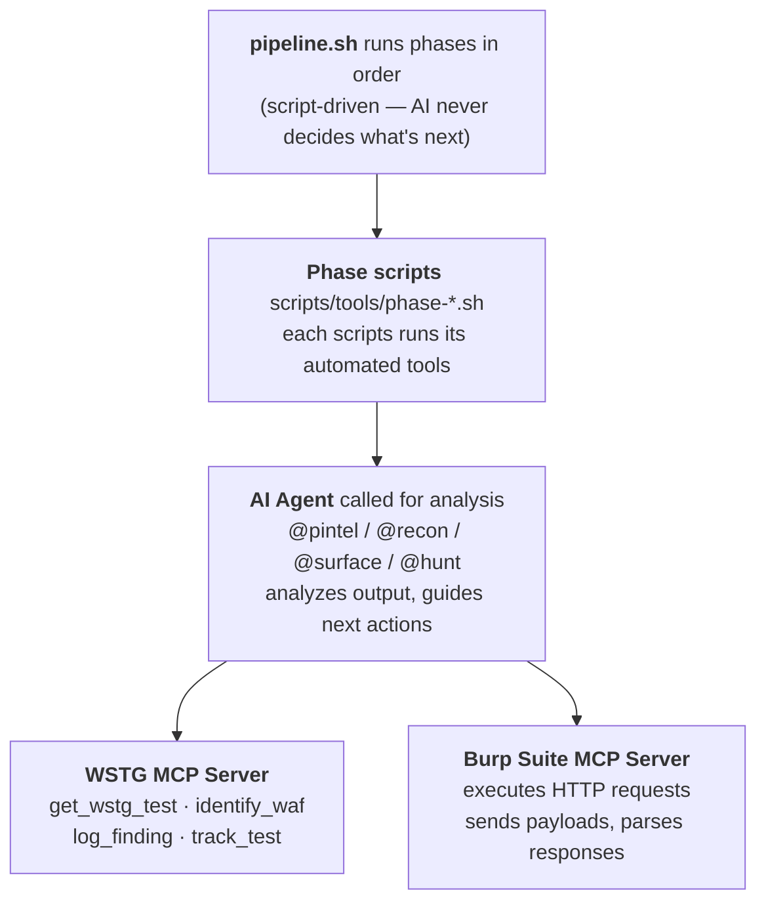
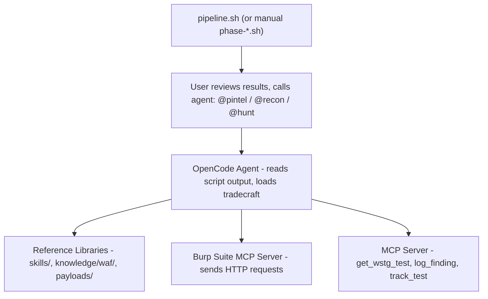

```mermaid
flowchart LR
    SCOPE --> AUTH --> INTEL --> RECON --> SURFACE --> HUNT --> DEEPTHINK --> EXPLOIT --> SEARCH --> CAPTURE --> VALIDATE --> REPORT
    HUNT -->|"Ralph Wiggum: untested endpoints?"| HUNT
    EXPLOIT -->|"Exhaustive gate: un-exploited findings?"| EXPLOIT
    HUNT -.->|"zero findings"| DEEPTHINK
    EXPLOIT -.->|"WAF/CVE gaps"| SEARCH["SEARCH (research)"]
    SEARCH -->|"payloads found"| EXPLOIT
    VALIDATE -->|PASS| REPORT
    VALIDATE -->|KILL| DISCARD["Discard"]
    VALIDATE -->|DOWNGRADE| REPORT
    VALIDATE -->|CHAIN| HUNT

    subgraph Gate["7-Question Gate"]
        Q1["Q1: Real HTTP request?"]
        Q2["Q2: Accepted impact?"]
        Q3["Q3: Asset in scope?"]
        Q4["Q4: Without privileged access?"]
        Q5["Q5: Not known behavior?"]
        Q6["Q6: Provable impact?"]
        Q7["Q7: Not on never-submit list?"]
    end

    subgraph Tracking["MCP tracks everything"]
        direction LR
        R1["register_scope()"] --> T1["track_test()"] --> L1["log_finding()"]
        L1 --> T2["track_tool()"] --> C1["get_coverage()"] --> R2["generate_report()"]
    end
```

# Pipeline — How Dristi Runs

## What Dristi Is

Dristi is a **script-driven** security testing pipeline. Bash scripts run each phase in strict order. The AI (LLM) is called **only for analysis** within each phase — it never decides what phase to run next.

Two interfaces work together:

1. **Pipeline Scripts** (`scripts/pipeline.sh` + `scripts/tools/phase-*.sh`) — automate the 12-phase pipeline: scope → auth → intel → recon → surface → hunt → exploit → validate → report
2. **OpenCode Agents** — provide per-class bug hunting tradecraft, enterprise platform attack chains, and analysis *within* each phase via `@agent-name`

Together they turn an LLM into a methodical bug hunter: the pipeline tells it *what order to do things in*, the agents tell it *what to look for and how*, and Burp Suite provides *HTTP request execution*.

---

## Working Principle



The loop: **pipeline.sh → phase script runs tools → AI analyzes results → log finding → next phase**

Each phase has its own script at `scripts/tools/phase-<name>.sh`. Run them individually or use `pipeline.sh` to run them in order.

**Two modes:**
- **Automatic** — `bash scripts/pipeline.sh target.com` runs all 12 phases in strict order
- **Selective** — `bash scripts/pipeline.sh target.com 3-6` runs phases 3 through 6
- **Manual** — `bash scripts/tools/phase-recon.sh target.com` runs a single phase

---

## The Pipeline (12 Phases + conditional sub-phases)

```
Phase 1:   SCOPE       → register domains, load config, create task tree
Phase 2:   AUTH        → test credentials, detect WAF, save auth deliverable
Phase 3:   INTEL       → passive OSINT: WHOIS, M365, cloud, spoof check
Phase 4:   RECON       → subdomain enum, crawl, params, secrets
Phase 5:   SURFACE     → load recon, classify tiers + functional groups, prioritize endpoints
Phase 6:   HUNT        → test all bug classes via 54 hunt-* sub-agents
                        ├── group-based testing (1-2 reps per functional group)
                        ├── Ralph Wiggum loop: every endpoint must be covered before gate
                        └── (parallel) credential-attack → wordlist-gen → breach-check → osint-employees → spray
Phase 7:   DEEPTHINK  → (conditional) first-principles gap analysis when HUNT yields zero
Phase 8:   EXPLOIT     → deepen confirmed findings, escalate impact
                        ├── multi-auth-context probing (replay every finding with all sessions)
                        └── exhaustive exploitation gate (no finding skipped)
Phase 9:   SEARCH → (conditional) 13-resource retrieval when EXPLOIT stalls
Phase 10:  CAPTURE     → evidence collection, screenshots, redaction
Phase 11:  VALIDATE    → re-validate PoCs, 7-Question Gate
Phase 12:  REPORT      → coverage check, generate final report
```



---

### Phase 1: SCOPE

| Step | Action | Script |
|------|--------|--------|
| 1 | Register target domain | `scripts/tools/phase-scope.sh <domain>` |
| 2 | Scaffold output directories | auto creates `$RECON_BASE/<domain>/{scope,intel,recon,...}` |
| 3 | Check target reachability | curl connectivity test |
| 4 | Write target metadata | `scope/target.txt`, `scope/started.txt` |
| 5 | Gate check | `scripts/tools/phase_gate.sh 1 <domain>` |

**Output:** `$RECON_BASE/<domain>/scope/` — scaffolded engagement.

---

### Phase 2: AUTH

| Step | Action | Script |
|------|--------|--------|
| 1 | Provide credentials / session tokens | manual (no script can guess these) |
| 2 | WAF fingerprint check | `scripts/tools/phase-auth.sh <domain>` |
| 3 | Save auth context | output in `$RECON_BASE/<domain>/auth/waf_detection.txt` |
| 4 | Gate check | `scripts/tools/phase_gate.sh 2 <domain>` |

**CRITICAL:** If Cloudflare detected, redirect 80% effort to API subdomain; use Playwright stealth for CF pages. Check WAF fingerprints at `knowledge/waf/`.

**Output:** `$RECON_BASE/<domain>/auth/` — WAF info + auth notes.

---

### Phase 3: Intel (passive)

| Step | Action | Script |
|------|--------|--------|
| 1 | WHOIS lookup, M365/Azure tenant discovery | `scripts/tools/phase-intel.sh <domain>` |
| 2 | SPF/DMARC spoofability check | auto (Spoofy — not auto-installed) |
| 3 | Third-party SaaS misconfiguration scan | auto (misconfig-mapper) |
| 4 | Cloud storage bucket enumeration | auto (manual — not auto-installed) |
| 5 | Gate check | `scripts/tools/phase_gate.sh 3 <domain>` |

**Script:** `bash scripts/tools/phase-intel.sh <domain>`

**Output:** `$RECON_BASE/<domain>/intel/` — WHOIS, cloud, spoof, third-party data.

---

### Phase 4: RECON

| Step | Action | Script |
|------|--------|--------|
| 1 | Subdomain enumeration | `scripts/tools/subdomain_enum.sh <domain>` |
| 2 | Web crawling (passive) | `scripts/tools/web_waymore.sh <domain>` |
| 3 | Web crawling (active) | `scripts/tools/web_gospider.sh <domain>` |
| 4 | Web crawling (katana) | `scripts/tools/web_katana.sh <domain>` |
| 5 | URL merge + dedup | auto (uro) → `crawl/merged-crawl.txt` |
| 6 | Parameter extraction | `scripts/tools/param_extract.sh <domain>` |
| 7 | Cariddi secrets/info scan | `scripts/tools/cariddi_scan.sh <domain>` |
| 7 | DNS bruteforce | `scripts/tools/dns_bruteforce.sh <domain>` |
| 8 | Vhost fuzzing | `scripts/tools/vhost_fuzz.sh <domain>` |
| 9 | Directory bruteforce | `scripts/tools/dir_bruteforce.sh <domain>` |
| 10 | Zone transfer check | `scripts/tools/zone_transfer.sh <domain>` |
| 11 | Secrets discovery | `scripts/tools/secrets_hunter.sh <domain>` |
| 12 | Cloud recon | `scripts/tools/cloud_recon.sh <domain>` |
| 13 | Takeover scanner | `scripts/tools/takeover_scanner.sh <domain>` |
| 14 | Gate check | `scripts/tools/phase_gate.sh 4 <domain>` |

**Script (all-in-one):** `bash scripts/tools/auto_recon.sh <domain>` or `bash scripts/tools/phase-recon.sh <domain>`

**CRITICAL:** Never invoke tool binaries directly or install tools. All tools pre-installed.

**Output:** `$RECON_BASE/<domain>/` — subdomains/, crawl/, params/, secrets/, directories/, vhost/

---

### Phase 5: SURFACE

| Step | Action | Script |
|------|--------|--------|
| 1 | Collect all discovered URLs | `scripts/tools/phase-surface.sh <domain>` |
| 2 | Classify into Tiers | Tier 0 (public+input), Tier 1 (auth+input), Tier 2 (infra) |
| 3 | Count endpoints per tier | auto |
| 4 | Save ranked endpoint map | `surface/endpoint_map_ranked.txt` |
| 5 | Gate check | `scripts/tools/phase_gate.sh 5 <domain>` |

**Script:** `bash scripts/tools/phase-surface.sh <domain>`

**Output:** `$RECON_BASE/<domain>/surface/endpoint_map_ranked.txt`

---

### Phase 6: HUNT

| Step | Action | Script |
|------|--------|--------|
| 1 | Parameter extraction + fuzzing | `scripts/tools/param_extract.sh`, `param_discovery.sh` |
| 2 | Secrets hunting | `scripts/tools/secrets_hunter.sh <domain>` |
| 3 | SQLi automation | `scripts/tools/auto_sqli.sh <domain>` |
| 4 | XSS automation | `scripts/tools/auto_xss.sh <domain>` |
| 5 | Directory bruteforce | `scripts/tools/dir_bruteforce.sh <domain>` |
| 6 | VHost fuzzing | `scripts/tools/vhost_fuzz.sh <domain>` |
| 7 | 403 bypass checks | `scripts/tools/bypass_403.sh <domain> --quick` |
| 8 | **AI-led testing** — call `@hunt` agent | analyzes results, guides per-class testing |
| 9 | Gate check | `scripts/tools/phase_gate.sh 6 <domain>` |

**Script:** `bash scripts/tools/phase-hunt.sh <domain>` (runs steps 1-7 automatically)

**For AI-driven analysis (step 8):** Call `@hunt` agent with the surface map. It loads the per-class tradecraft automatically:

| Class | Load with… |
|-------|-----------|
| XSS | `@hunt-xss` |
| SQLi | `@hunt-sqli` |
| SSRF | `@hunt-ssrf` |
| IDOR | `@hunt-idor` |
| SSTI | `@hunt-ssti` |
| CMDI/RCE | `@hunt-rce` |
| Auth bypass | `@hunt-auth-bypass` |
| ATO | `@hunt-ato` |
| GraphQL | `@hunt-graphql` |
| File upload | `@hunt-file-upload` |
| Race condition | `@hunt-race-condition` |
| OAuth | `@hunt-oauth` |
| CORS | `@hunt-cors` |
| XXE | `@hunt-xxe` |
| CSRF | `@hunt-csrf` |
| NoSQLi | `@hunt-nosqli` |
| LDAP | `@hunt-ldap` |
| Open redirect | `@hunt-open-redirect` |
| HTTP smuggling | `@hunt-http-smuggling` |
| Deserialization | `@hunt-deserialization` |
| Subdomain takeover | `@hunt-subdomain` |
| Cloud IAM | `@cloud-iam-deep` |
| M365/Entra | `@m365-entra-attack` |
| Android APK | `@apk-redteam-pipeline` |
| Smart contract | `web3-audit` (skill) |
| K8s | `@hunt-k8s` |
| Next.js | `@hunt-nextjs` |

**If WAF detected in Phase 2:** Pass to AI agent which applies vendor-specific bypasses from `knowledge/waf/`.

**Output:** `$RECON_BASE/<domain>/` — params/, secrets/, sqli/, xss/, directories/, vhost/

---

### Phase 7: DEEPTHINK (conditional)

| Step | Action | Script |
|------|--------|--------|
| 1 | Prepare gap analysis context | `scripts/tools/phase-deepthink.sh <domain>` |
| 2 | Call `@deepthink` agent | AI performs first-principles gap analysis |
| 3 | Gate check | `scripts/tools/phase_gate.sh 7 <domain>` |

**Script:** `bash scripts/tools/phase-deepthink.sh <domain>`
**Agent:** `@deepthink` — reads gap context, identifies blind spots

---

### Phase 8: EXPLOIT

| Step | Action | Script |
|------|--------|--------|
| 1 | Compile all findings | `scripts/tools/phase-exploit.sh <domain>` |
| 2 | Call `@exploit` agent | AI deepens findings, chains, escalates |
| 3 | Multi-auth-context probing | AI replays findings with all sessions |
| 4 | Exploitation gate | Every finding must have PoC or bypass exhaustion |
| 5 | Gate check | `scripts/tools/phase_gate.sh 8 <domain>` |

**Script:** `bash scripts/tools/phase-exploit.sh <domain>`
**Agent:** `@exploit` — loads compiled findings, attempts PoC exploitation

---

### Phase 9: SEARCH (conditional)

| Step | Action | Script |
|------|--------|--------|
| 1 | Prepare research context | `scripts/tools/phase-search.sh <domain>` |
| 2 | Call `@search` agent | AI researches payloads, CVEs, bypasses |
| 3 | Feed results back to EXPLOIT | Findings from research → new exploit attempts |

**Script:** `bash scripts/tools/phase-search.sh <domain>`
**Agent:** `@search` — researches stale payloads, missing CVEs, WAF bypasses

---

### Phase 10: CAPTURE

| Step | Action | Script |
|------|--------|--------|
| 1 | Prepare evidence structure | `scripts/tools/phase-capture.sh <domain>` |
| 2 | Call `@capture` + `@evidence-hygiene` | AI captures screenshots, redacts PII |
| 3 | Save sanitized evidence | `$RECON_BASE/<domain>/evidence/<finding-id>/` |

**Script:** `bash scripts/tools/phase-capture.sh <domain>`
**Browser rules:** Use Playwright for screenshots. Call `playwright_browser_close()` after every operation.

---

### Phase 11: VALIDATE

| Step | Action | Script |
|------|--------|--------|
| 1 | Prepare findings for validation | `scripts/tools/phase-validate.sh <domain>` |
| 2 | Call `@validate` + `@triage-validation` | AI runs 7-Question Gate on each finding |
| 3 | Assign verdict | PASS / KILL / DOWNGRADE / CHAIN REQUIRED |

**Script:** `bash scripts/tools/phase-validate.sh <domain>`

**The 7-Question Gate** (run by AI agent):
```
Q1: Real HTTP request?
Q2: Accepted impact?
Q3: In scope?
Q4: Without privileged access?
Q5: Not known behavior?
Q6: Provable impact?
Q7: Not on never-submit list?
```

**Never-submit list:** Missing headers, introspection alone, clickjacking alone, self-XSS, open redirect alone, SSRF DNS-only, logout CSRF, rate limits on non-critical forms, cookie flags alone.

---

### Phase 12: REPORT

| Step | Action | Script |
|------|--------|--------|
| 1 | Compile report context | `scripts/tools/phase-report.sh <domain>` |
| 2 | Call `@report-writing` agent | AI generates submission-ready report |
| 3 | Choose platform | HackerOne (`@report-writing`) / Bugcrowd (`@bugcrowd-reporting`) / Client (`@redteam-report-template`) |
| 4 | Final gate | `scripts/tools/phase_gate.sh 12 <domain>` |

**Script:** `bash scripts/tools/phase-report.sh <domain>`
**Output:** `$RECON_BASE/<domain>/report/report_context.txt` → AI generates final report.

---

## How Pipeline Scripts + Agents Interact



**At every phase, the pattern is the same:**

1. Run the phase script: `bash scripts/tools/phase-<name>.sh <domain>`
2. Script runs automated tools, saves output
3. Call the appropriate AI agent: `@pintel`, `@recon`, `@surface`, `@hunt`, etc.
4. Agent reads the output, loads tradecraft from reference libraries
5. Agent guides further testing via Burp MCP
6. Findings are logged via MCP server

---

## Quickstart

```bash
# Run all 12 phases in order
bash scripts/pipeline.sh target.com

# Run phases 3-6 only
bash scripts/pipeline.sh target.com 3-6

# Run a single phase
bash scripts/tools/phase-recon.sh target.com

# Call AI agent to analyze results
# In OpenCode: @recon analyze the recon output for target.com
```

---

## Key Design Principles

1. **Script-driven, not agent-driven** — `pipeline.sh` runs phases in order; the AI never decides "what's next"
2. **AI for analysis only** — agents analyze results and guide testing, they don't orchestrate phases
3. **Phase gates enforce ordering** — `phase_gate.sh` tracks completed phases and warns on skips
4. **Each phase has one script** — `scripts/tools/phase-<name>.sh` — run it or call it via pipeline.sh
5. **Validate before drafting** — the 7-Question Gate prevents wasted effort on N/A findings
6. **MCP tracks everything** — findings, tests, tools, coverage — nothing gets lost
7. **Evidence hygiene by default** — redact before capture, not after
8. **Burp is optional** — curl + browser works fine for most testing
9. **References guide technique** — real H1 reports, WAF KBs, and payload libs inform every test
10. **Browser close after every op** — `playwright_browser_close()` mandate to prevent context leaks
