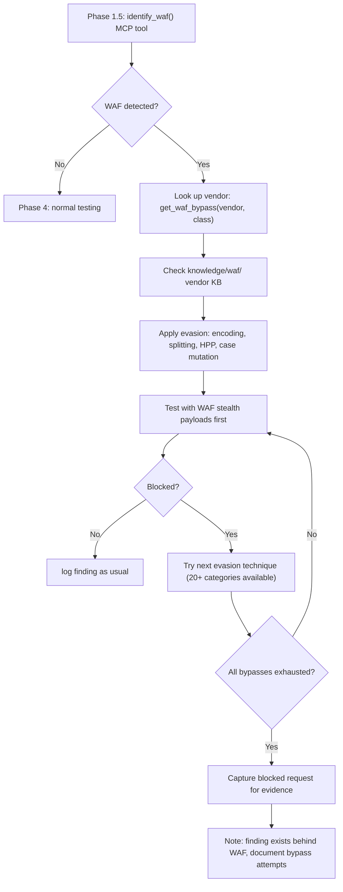

# Test Flow — How Dristi Chooses What to Test

## Overview

Dristi uses a **triage-first, reference-informed** testing strategy. Not every endpoint gets every test — the pipeline classifies endpoints by risk, checks disclosed report patterns for the target's tech stack, and dispatches per-class hunt agents with WSTG methodology, real-world report references, and WAF-aware payload selection.

82 agents total: 54 specialized `@hunt-*` agents + 28 pipeline/specialty agents.

---

## 7-Phase Pipeline

```
SCOPE(1) → AUTH(1.5) → OSINT(1.75) → RECON(2) → SURFACE(3) → HUNT(4) → CAPTURE(5) → VALIDATE(6) → REPORT(7)
```

### Phase P1: SCOPE
- Register target domains
- Load engagement config
- Create task tree

### Phase P1.5: AUTH
- Sign-up / credential validation
- Fingerprint WAF via `identify_waf()` MCP tool
- Look up vendor fingerprints in `knowledge/waf/waf-knowledge-base/02-waf-fingerprints/`
- Apply stealth proxy (Playwright CF bypass) if Cloudflare detected
- Save `auth_analysis` deliverable

### Phase P1.75: OSINT (passive)
- WHOIS lookup, M365/Azure tenant discovery (`whois` + `msftrecon`)
- Scopify scope analysis from registered domain
- Third-party SaaS misconfiguration scan (`misconfig-mapper`)
- SPF/DMARC spoofability check (`Spoofy`)
- Cloud storage bucket enumeration (`cloud_enum` — AWS S3, Azure Blob, GCP, DO Spaces)
- Runs via `scripts/tools/phase-intel.sh <domain>`
- Output to `runtime/engagements/<eid>/recon/<domain>/intel/`
- Skipped: `ip_info` (requires `WHOISXML_API` key)

### Phase P2: RECON
- Subdomain enumeration + DNS bruteforce
- Web crawling, parameter extraction
- Nuclei, directory bruteforce, 403 bypass, vhost fuzzing
- Zone transfer, takeover scanner, cloud recon
- CVE scanning, secret discovery
- Answer 3 triage questions per endpoint
- Save `endpoint_map_raw` deliverable

### Phase P3: SURFACE
- Load `endpoint_map_raw` deliverable
- Classify into Tiers (T0: public+input, T1: auth+input, T2: infra)
- Risk-score each endpoint via `prioritize_endpoints()`
- Save `endpoint_map_ranked` deliverable

### Phase P4: HUNT
- Load `endpoint_map_ranked` + `auth_analysis`
- **Deep testing** — API fuzzing, method override, content-type switch, GraphQL probing, race conditions, UUID analysis, JWT manipulation
- **WAF handling** — apply vendor-specific bypass payloads from `get_waf_bypass()` + `knowledge/waf/`
- For each endpoint tier, dispatch applicable `@hunt-*` agents:
  - Tier 0 endpoints → full battery (XSS, SSRF, SQLi, SSTI, CMDI, IDOR, CSRF, etc.)
  - Tier 1 endpoints → auth-dependent tests (ATO, IDOR, OAuth, JWT, business logic)
  - Tier 2 endpoints → infra tests (subdomain takeover, TLS, CORS, host header)
- Validate PoC before logging: `validate_poc()`
- Log findings: `log_finding()`, `track_test()`
- Check chaining opportunities: `find_chains()`
### Phase P5: CAPTURE
- Load confirmed findings via `get_findings()`
- Load evidence-hygiene for redaction protocol
- Capture raw HTTP + screenshot (Playwright) + collaborator (if OOB)
- Capture blocked vs. bypassed request pairs if WAF was present
- Apply redaction (cookies, PII, tokens)
- Save sanitized evidence

### Phase P6: VALIDATE
- Re-validate each PoC via `validate_poc()` or `validate_finding_poc()`
- Cross-reference severity against MCP technique guides
- Run the 7-Question Gate (real request? accepted impact? in scope? no privileged access? not known? provable? not never-submit?)
- Assign verdict: PASS / KILL / DOWNGRADE / CHAIN-REQUIRED
- Update finding via `update_finding()`

### Phase P7: REPORT
- Check WSTG coverage: `get_coverage()`
- Check tool coverage: `get_tool_coverage()`
- Gate check: `phase_gate_check(phase_completed=6)`
- Generate `generate_report()`
- Submit via platform-specific reporter (H1, Bugcrowd, or client)

---

## Attack Surface Triage

### Tier Definitions

| Tier | Access | Auth Required | Examples | Tests |
|------|--------|--------------|----------|-------|
| T0 | Public + Input | No | Search, feedback, API public params | XSS, SSRF, SQLi, CMDI, SSTI, IDOR, CSRF, CORS, GraphQL, race, open redirect, host header, cache poision, deserialization |
| T1 | Auth + Input | Yes | Account settings, payments, admin | ATO, OAuth, JWT, session, business logic, MFA bypass, IDOR (cross-user), API misconfig, rate limiting |
| T2 | Infrastructure | Varies | CDN, DNS, subdomains, TLS, cloud | Subdomain takeover, TLS/SSL, cloud misconfig, cache poision, HTTP smuggling, CORS, host header |

### Priority Scoring

`prioritize_endpoints()` calculates risk score from:
- Parameter count (more = higher surface)
- Technology risk (known-vulnerable frameworks)
- Taint chain presence (endpoint reads user input and reaches a sink)
- Tool convergence (same endpoint flagged by multiple tools)
- Auth requirement (auth-bypass opportunity)
- HTTP method (POST/PUT/DELETE > GET)
- Injectable parameter names (id, file, url, redirect, template, cmd, etc.)

---

## WAF Handling Flow



If Cloudflare: redirect 80% of effort to API subdomain (api.*), use Playwright stealth proxy.

---

## Reference Libraries Available at Test Time

| Reference | Path | Contents |
|-----------|------|----------|
| WSTG Tests | MCP Server (`get_wstg_test()`) | 96 test cases across 13 categories |
| Technique Guides | MCP Server (`get_technique_guide()`) | 26 technique references |
| PayloadsAllTheThings | `knowledge/payloads/` | 64 categories, ~25K payloads |
| WAF Fingerprints | `knowledge/waf/waf-knowledge-base/02-waf-fingerprints/` | 144 vendor fingerprints |
| WAF Bypasses | `knowledge/waf/waf-knowledge-base/04-known-bypasses/` | 24 vendor bypass files |
| WAF Evasion | `knowledge/waf/waf-knowledge-base/03-evasion-techniques/` | 21 evasion categories |
| WAF Skills | `knowledge/waf/skills/` | 15 loadable WAF skills |
| PAT Test Harnesses | `scripts/payloads/` | 12 test.sh for automated class testing |

---

## Agent Dispatch in Hunt Phase

```
User describes target
    │
    ▼
@hunt (dispatcher agent) loads endpoint_map_ranked
    │
    ▼
For each endpoint tier:
    ├── T0 → dispatch: @hunt-xss, @hunt-sqli, @hunt-ssrf, @hunt-ssti,
    │                   @hunt-rce, @hunt-idor, @hunt-csrf, @hunt-cors,
    │                   @hunt-xxe, @hunt-graphql, @hunt-open-redirect,
    │                   @hunt-host-header, @hunt-file-upload, @hunt-nosqli,
    │                   @hunt-ldap, @hunt-race-condition, @hunt-cache-poison,
    │                   @hunt-dom, @hunt-source-leak, @hunt-http-smuggling,
    │                   @hunt-deserialization, @hunt-lfi
    │
    ├── T1 → dispatch: @hunt-ato, @hunt-oauth, @hunt-jwt-confusion,
    │                   @hunt-session, @hunt-business-logic, @hunt-mfa-bypass,
    │                   @hunt-auth-bypass, @hunt-api-misconfig, @hunt-idor,
    │                   @hunt-brute-force, @hunt-aspnet, @hunt-laravel,
    │                   @hunt-springboot, @hunt-sharepoint, @hunt-nodejs,
    │                   @hunt-nextjs, @hunt-saml
    │
    └── T2 → dispatch: @hunt-subdomain, @hunt-tls-network,
                        @hunt-cloud-misconfig, @hunt-ntlm-info,
                        @hunt-k8s, @hunt-cicd
                        @hunt-websocket
    │
    ▼
Each hunt agent:
    1. Reads H1 reports for its class
    2. Gets WSTG test case + technique guide
    3. Identifies WAF (if already detected, skips)
    4. Fetches test payloads
    5. Picks witness payloads for its sink contexts
    6. Validates PoC
    7. Logs finding if confirmed
    8. Checks chaining to other registered findings
```

---

## Per-Class Agent Capabilities

Every `@hunt-*` agent contains in its SKILL prompt:

1. **WSTG methodology reference** — Which test IDs apply (e.g., WSTG-INPV-01 for XSS)
2. **Deep testing workflow** — Entry point mutation, injection point expansion
3. **BurpSuite pro workflow** — Per-class Burp MCP tool usage
4. **PayloadsAllTheThings reference** — PAT README path
5. **Disclosed reports reference** — H1 per-class file + top 5 impactful reports
6. **WAF fingerprint reference** — identify_waf() invocation, vendor KB file, bypass files
7. **Code analysis findings** — Source code patterns when source is available

---

## Key Design Decisions in Test Flow

1. **Deep testing before class-specific**: Fuzz all parameters first, then apply class-specific payloads
2. **WAF bypass before exploit**: Don't waste time crafting payloads that get blocked; handle WAF first
3. **H1 reports before payloads**: Real-world patterns beat generic payload lists
4. **Tier-based dispatch**: Public+input endpoints get the most attention (highest ROI)
5. **Validate before logging**: `validate_poc()` catches false positives before they enter the database
6. **Chain awareness**: `find_chains()` runs after each finding is logged to build attack paths
7. **Coverage tracking**: Every test and tool execution is tracked for report completeness
