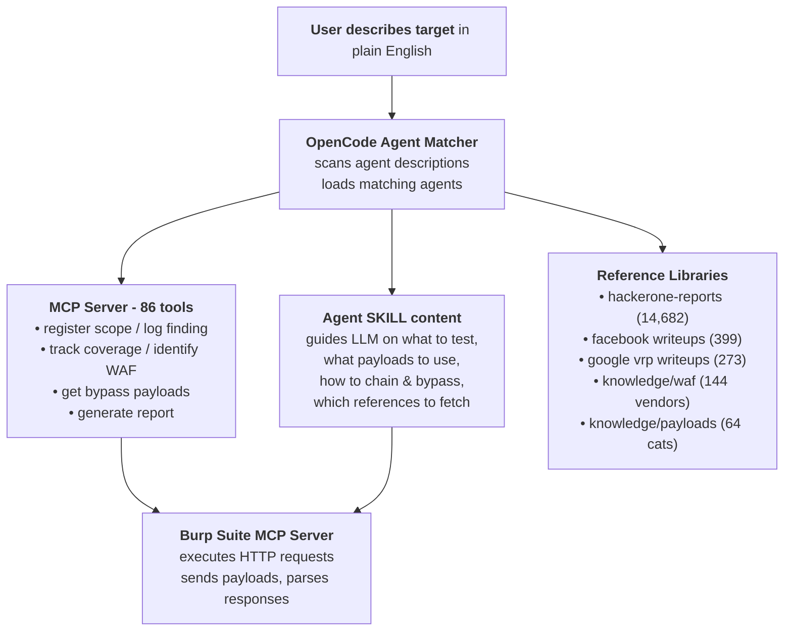
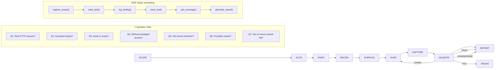
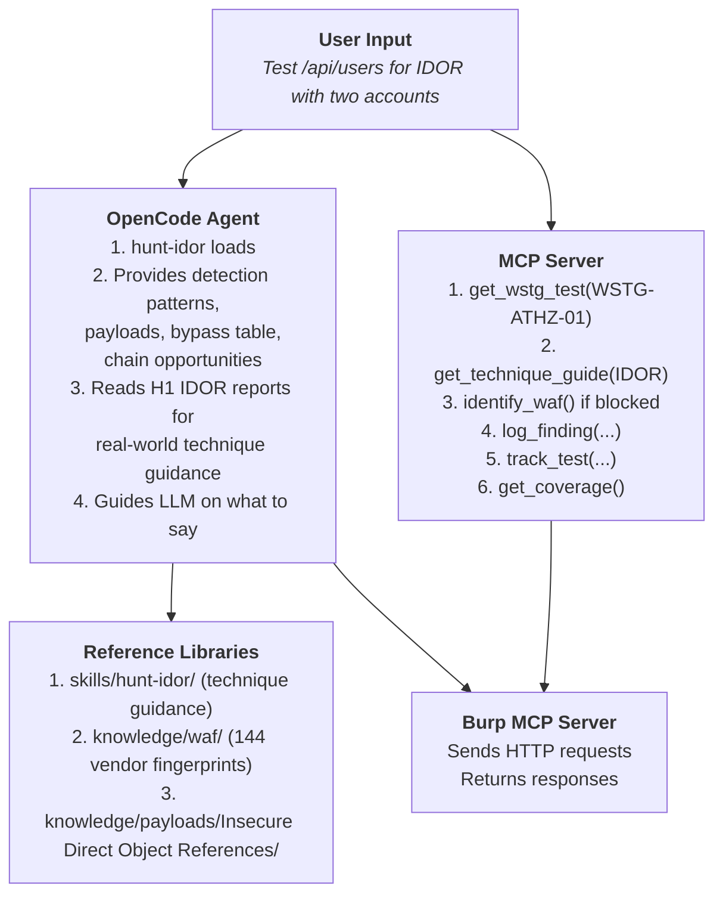

# Workflow — How Dristi Works

## What Dristi Is

Dristi is a security testing platform with two interfaces that work together:

1. **MCP Server** (86 tools) — provides the OWASP WSTG methodology, engagement management, findings database, phase gates, WAF identification/evasion, and reporting as callable tools
2. **OpenCode Agents** (82 agents) — provides per-class bug hunting tradecraft, enterprise platform attack chains, and engagement lifecycle management via `@agent-name`

Together they turn an LLM into a methodical bug hunter: the agents tell it *what to look for and how*, the MCP server gives it the *structured methodology and tracking*, and Burp Suite provides *HTTP request execution*.

---

## Working Principle



The loop: **describe → agent loads → MCP tracks → references guide → Burp executes → analyze → log finding → validate → report**

All agents are invoked via `@agent-name`. 10 pipeline agents: `@autopilot` → `@consult` → `@scope` → `@pintel` → `@recon` → `@surface` → `@hunt` → `@capture` → `@validate` → `@report`. 54 specialized `@hunt-*` agents + 18 non-hunt specialty agents (82 total).

**Two modes:**
- **`@autopilot`** — runs fully autonomous, dispatches phases 2-7 via `task()` to sub-agents, ends with report
- **`@consult`** — same pipeline, interactive at every phase transition with suggestions
- **Manual** — `@scope` → `@recon` → ... step-by-step

---

## The Pipeline (7 Phases + Auth)

```
Phase 1:   SCOPE     → register domains, load config, create task tree
Phase 1.5: AUTH      → test credentials, detect WAF, save auth deliverable
Phase 2:   RECON     → subdomain enum, crawl, params, nuclei, secrets
Phase 3:   SURFACE   → load recon, classify tiers, prioritize endpoints
Phase 4:   HUNT      → test all bug classes via 54 hunt-* sub-agents
Phase 5:   CAPTURE   → evidence collection, screenshots, redaction
Phase 6:   VALIDATE  → re-validate PoCs, 7-Question Gate
Phase 7:   REPORT    → coverage check, generate final report
```



---

### Phase 1: SCOPE

**Goal:** Understand the target, define what's in/out, scaffold the engagement.

| Step | Action | MCP Tools |
|------|--------|-----------|
| 1 | Ask user for target domain(s) and credentials | — |
| 2 | Parse scope table if provided | `parse_scope_table()` |
| 3 | Load engagement config | `load_engagement_config()` |
| 4 | Register all domains with types | `register_scope()` / `register_scope_batch()` |
| 5 | Create engagement in database | `findings_init()` |
| 6 | Create phase tracking tree | `create_task_tree()` |
| 7 | Gate check | `phase_gate_check(phase_completed=0)` |

**Output:** Registered engagement with scope boundaries, task tree created.

---

### Phase 1.5: AUTH

**Goal:** Obtain authentication credentials and detect WAF before testing.

| Step | Action | MCP Tools |
|------|--------|-----------|
| 1 | Check for existing credentials | `get_engagement_config()` |
| 2 | Sign up or provide API key | — |
| 3 | Test auth works | `curl -sv <target>/api/me` |
| 4 | **WAF fingerprint check** | `identify_waf()` with response headers + body |
| 5 | If Cloudflare detected | Redirect 80% effort to API subdomain; use Playwright stealth for CF pages |
| 6 | Look up vendor fingerprints | `knowledge/waf/waf-knowledge-base/02-waf-fingerprints/<vendor>.md` |
| 7 | Save auth context with real tokens | `save_deliverable('auth_analysis', ...)` |

**WAF Detection:**
```bash
curl -sI https://<domain>/ 2>&1 | grep -i "server:\|cf-ray\|x-sucuri\|x-iinfo\|x-mod-security\|x-waf"
```
Pass headers + body through `identify_waf()` MCP tool. If identified, check vendor-specific fingerprints and known bypasses at `knowledge/waf/`.

**Output:** `auth_analysis` deliverable with tokens, WAF vendor info.

---

#---

### Phase 1.75: Intel (passive)

**Goal:** Passive intelligence gathering — WHOIS, cloud footprint, third-party exposure, email spoofability.

| Step | Action | Tool |
|------|--------|------|
| 1 | WHOIS lookup, M365/Azure tenant discovery | `whois`, `msftrecon` |
| 2 | Scope analysis from registered domain | `Scopify` |
| 3 | Third-party SaaS misconfiguration scan (Slack, Jira, GitHub, etc.) | `misconfig-mapper` |
| 4 | SPF/DMARC spoofability check | `Spoofy` |
| 5 | Cloud storage bucket enumeration (AWS S3, Azure Blob, GCP, DO Spaces) | `cloud_enum` |

**Script:** `scripts/tools/phase-intel.sh`

**Note:** `ip_info` module (reverse IP, IP WHOIS, geolocation) is skipped — requires `WHOISXML_API` key.

**Output:** Intel data to `runtime/engagements/<id>/recon/<domain>/intel/` — consumed by RECON for target context and by HUNT agents for WAF/cloud/third-party awareness.

---

## Phase 2: RECON

**Goal:** Discover attack surface — subdomains, endpoints, technologies, secrets.

| Step | Action | MCP Tools |
|------|--------|-----------|
| 1 | Subdomain enumeration + DNS bruteforce | `track_tool()` |
| 2 | Web crawling, parameter extraction | `track_tool()` |
| 3 | Cariddi, nuclei, directory bruteforce | `track_tool()` |
| 4 | 403 bypass, vhost fuzzing | `track_tool()` |
| 5 | Zone transfer, takeover scanner | `track_tool()` |
| 6 | Cloud recon, CVE scan, secrets discovery | `track_tool()` |
| 7 | Answer 3 triage questions per endpoint | — |
| 8 | Save endpoint map deliverable | `save_deliverable('endpoint_map_raw', ...)` |
| 9 | Gate check | `phase_gate_check(phase_completed=1)` |

**MCP tools used:** `track_tool`, `parse_tool_output`, `ingest_tool_file`, `verify_tool_result`

**Output:** `endpoint_map_raw` deliverable with all discovered endpoints and triage answers.

---

### Phase 3: SURFACE

**Goal:** Convert raw recon output into a prioritized "test these first" list.

| Step | Action | MCP Tools |
|------|--------|-----------|
| 1 | Load endpoint_map_raw deliverable | `get_deliverable('endpoint_map_raw')` |
| 2 | Check skills for relevant hunt-class tradecraft | skills/ |
| 3 | Classify into Tiers | Tier 0 (public+input) / Tier 1 (auth+input) / Tier 2 (infra) |
| 4 | Risk-score each endpoint | `prioritize_endpoints()` |
| 5 | Save ranked deliverable | `save_deliverable('endpoint_map_ranked', ...)` |
| 6 | Gate check | `phase_gate_check(phase_completed=2)` |

**Output:** `endpoint_map_ranked` deliverable consumed by Phase 4.

---

### Phase 4: HUNT

**Goal:** Test for specific vulnerability classes using per-class tradecraft and reference libraries.

| Step | Action | MCP Tools |
|------|--------|-----------|
| 1 | Load endpoint_map_ranked + auth_analysis | `get_deliverable()` |
| 2 | Run deep testing (API fuzzing, method override, content-type switch, GraphQL probing, race conditions, UUID analysis, JWT manipulation) | — |
| 3 | **WAF handling:** If WAF detected in Phase 1.5, apply vendor-specific bypasses | `identify_waf()`, `get_waf_bypass()`, `knowledge/waf/` |
| 4 | **Test all applicable bug classes** via 54 hunt-* sub-agents | `get_wstg_test()`, `get_technique_guide()`, `get_test_payloads()`, `get_witness_payloads()` |
| 6 | For each confirmed finding: validate PoC, log, track test, check chaining | `validate_poc()`, `log_finding()`, `track_test()`, `find_chains()` |
| 7 | Gate check | `phase_gate_check(phase_completed=3)` |

**Agent auto-loading examples:**

| You say… | Agent loads |
|----------|-------------|
| "XSS on the search field — reflected, stored, DOM contexts" | `@hunt-xss` |
| "URL param accepts http:// URLs — testing SSRF" | `@hunt-ssrf` |
| "SQLi on the login — testing error, blind, time-based" | `@hunt-sqli` |
| "SSTI on template param — Jinja2/Twig/Freemarker" | `@hunt-ssti` |
| "CMDI on ping param — testing blind and OOB" | `@hunt-rce` |
| "IDOR in /api/users/{id} — cross-tenant access" | `@hunt-idor` |
| "Auth bypass on admin panel — path traversal" | `@hunt-auth-bypass` |
| "ATO on session — JWT manipulation, 2FA bypass" | `@hunt-ato` |
| "GraphQL at /graphql — introspection, mutations" | `@hunt-graphql` |
| "File upload on /profile/avatar — RCE via upload" | `@hunt-file-upload` |
| "Race condition on coupon — concurrent redemption" | `@hunt-race-condition` |
| "OAuth login — CSRF, redirect_uri, state bypass" | `@hunt-oauth` |
| "CORS misconfiguration — credentialed cross-origin" | `@hunt-cors` |
| "XXE in XML upload — OOB entity exfiltration" | `@hunt-xxe` |
| "CSRF on email-change endpoint" | `@hunt-csrf` |
| "NoSQLi on JSON login endpoint" | `@hunt-nosqli` |
| "LDAP injection on search endpoint" | `@hunt-ldap` |
| "Open redirect in ?next= parameter" | `@hunt-open-redirect` |
| "H2C smuggling on HTTP/2 endpoint" | `@hunt-http-smuggling` |
| "Deserialization in session cookie" | `@hunt-deserialization` |
| "Subdomain takeover — CNAME unclaimed" | `@hunt-subdomain` |
| "Cloud IAM — AWS/Azure/GCP privilege escalation" | `@cloud-iam-deep` |
| "M365 tenant — Entra ID, federation, SharePoint" | `@m365-entra-attack` |
| "Android APK — decompile, secrets, endpoints" | `@apk-redteam-pipeline` |
| "Smart contract audit — Solidity reentrancy" | `@web3-audit` |
| "Token audit — honeypot, liquidity, rug-pull" | `@meme-coin-audit` |
| "K8s pod escape" | `@hunt-k8s` |
| "Next.js API route without auth" | `@hunt-nextjs` |

**Reference Libraries** (available to every hunt agent during testing):

| Resource | Path | Contents |
|----------|------|----------|
| WAF Fingerprints | `knowledge/waf/waf-knowledge-base/02-waf-fingerprints/` | 144 vendor fingerprints |
| WAF Bypasses | `knowledge/waf/waf-knowledge-base/04-known-bypasses/` | 24 vendor bypass files |
| WAF Evasion | `knowledge/waf/waf-knowledge-base/03-evasion-techniques/` | 21 evasion categories |
| WAF Skills | `knowledge/waf/skills/` | 15 WAF skills (loadable via `skill()`) |
| Payloads | `knowledge/payloads/` | 64 PAT categories, 12 with test.sh |

**MCP tools used:** `get_wstg_test`, `get_test_payloads`, `get_technique_guide`, `get_witness_payloads`, `get_evidence_checklist`, `get_slot_types`, `log_finding`, `create_exploitation_queue`, `validate_exploitation_queue`, `get_exploitation_queue`, `get_waf_bypass`, `identify_waf`, `track_test`, `add_graph_node`, `add_graph_edge`, `find_chains`, `validate_poc`

**Output:** Confirmed findings logged to engagement database, exploitation queues created.

---

### Phase 5: CAPTURE

**Goal:** Capture evidence with proper hygiene — redact cookies, PII, sanitize.

| Step | Action | MCP Tools |
|------|--------|-----------|
| 1 | Load confirmed findings | `get_findings()` |
| 2 | Load evidence-hygiene for redaction protocol | `@evidence-hygiene` |
| 3 | For each finding: capture raw HTTP, screenshot (if DOM/visual), check collaborator (if OOB) | `validate_poc()` |
| 4 | **WAF evidence:** Capture blocked vs. bypassed request pairs, note evasion technique used | — |
| 5 | Apply redaction (cookies, PII, tokens) | — |
| 6 | Save sanitized evidence | `scripts/recon/<domain>/evidence/<finding-id>/` |
| 7 | Gate check | `phase_gate_check(phase_completed=4)` |

**Browser rules:** Use Playwright for screenshots. Call `playwright_browser_close()` after every operation. Never call `browser.newContext()` — default context already routes through Burp via `--proxy-server`.

**Output:** Sanitized evidence pack for each finding.

---

### Phase 6: VALIDATE

**Goal:** Decide whether a finding is reportable before writing anything.

| Step | Action | MCP Tools |
|------|--------|-----------|
| 1 | Load findings | `get_findings()` |
| 2 | Re-validate each PoC | `validate_poc()` |
| 3 | Cross-reference severity against MCP technique guides | `get_technique_guide()` |
| 4 | Run the 7-Question Gate | `@triage-validation` |
| 5 | Assign verdict | `update_finding()` |

**The 7-Question Gate:**
```
Q1: Can an attacker use this RIGHT NOW with a real HTTP request?
Q2: Is the impact on the program's accepted-impact list?
Q3: Is the vulnerable asset in scope?
Q4: Does it work without privileged access an attacker can't get?
Q5: Is this not already known or documented behavior?
Q6: Can impact be proved beyond "technically possible"?
Q7: Is this NOT on the never-submit list?
```

**Outcomes:**
- **PASS** — all 7 ✓ → proceed to Report
- **DOWNGRADE** — Q2 or Q5 fails → lower severity, still report
- **CHAIN REQUIRED** — needs another primitive → go back to Hunt
- **KILL** — any other failure → discard, do not draft

**Never-submit list:** Missing headers, introspection alone, clickjacking alone, self-XSS, open redirect alone, SSRF DNS-only, logout CSRF, rate limits on non-critical forms, cookie flags alone.

**Output:** Verdict for each finding (PASS / KILL / DOWNGRADE / CHAIN REQUIRED).

---

### Phase 7: REPORT

**Goal:** Generate a submission-ready report with coverage validation.

| Step | Action | MCP Tools |
|------|--------|-----------|
| 1 | Check WSTG coverage | `get_coverage()` |
| 2 | Check tool coverage | `get_tool_coverage()` |
| 3 | Final gate check | `phase_gate_check(phase_completed=6)` |
| 4 | Generate full report | `generate_report()` |
| 5 | Present report summary | — |
| 6 | Ask which platform (H1/Bugcrowd/Client) | — |

**Platform-specific reporters:**
- `@report-writing` — HackerOne/generic format
- `@bugcrowd-reporting` — Bugcrowd VRT mapping
- `@redteam-report-template` — Client-facing DOCX
- `@redteam-mindset` — Red-team ops posture

**Output:** `runtime/engagements/<eid>/report.md` — full pentest report.

---

## How MCP Server and Agents Interact



**At every phase, the pattern is the same:**

1. You describe what you're doing → agent loads with relevant tradecraft
2. Agent reads its reference library (H1 reports, WAF KB, PAT) for technique guidance
3. MCP server provides structured methodology (WSTG tests, technique guides) and tracking
4. Burp MCP (or curl) executes the actual HTTP requests
5. Findings are logged via MCP, tracked via MCP, reported via MCP

---

## Mode Comparison

| Feature | `@autopilot` | `@consult` | Manual |
|---------|-------------|------------|--------|
| Phases | 1–7 autonomous | 1–7 with prompts | Step-by-step |
| Sub-agent dispatch | `task()` for phases 2-7 | `task()` for phases 2-7 | Direct agent invocation |
| Phase gates | Automatic check + checkpoint | Ask before each gate | Manual |
| WAF handling | Automatic detection in Phase 1.5 | Detected + suggested bypasses | Manual |
| Reference fetching | Automatic pre-hunt reading | Suggested before testing | On-demand |
| Recovery | Auto-retry on gate failure | Suggests recovery options | Manual |
| Best for | Full engagement, no interruptions | Learning, guided testing | Targeted single-class testing |

---

## Key Design Principles

1. **Validate before drafting** — the 7-Question Gate prevents wasted effort on N/A findings
2. **Agents auto-load by topic** — you don't need to know agent names, just describe what you see
3. **MCP tracks everything** — findings, tests, tools, coverage — nothing gets lost
4. **Evidence hygiene by default** — redact before capture, not after
5. **Phase gates ensure quality** — don't skip to reporting without coverage validation
6. **Burp is optional** — curl + browser works fine for most testing
7. **References guide technique** — real H1 reports, WAF KBs, and payload libs inform every test
8. **Browser close after every op** — `playwright_browser_close()` mandate to prevent context leaks
