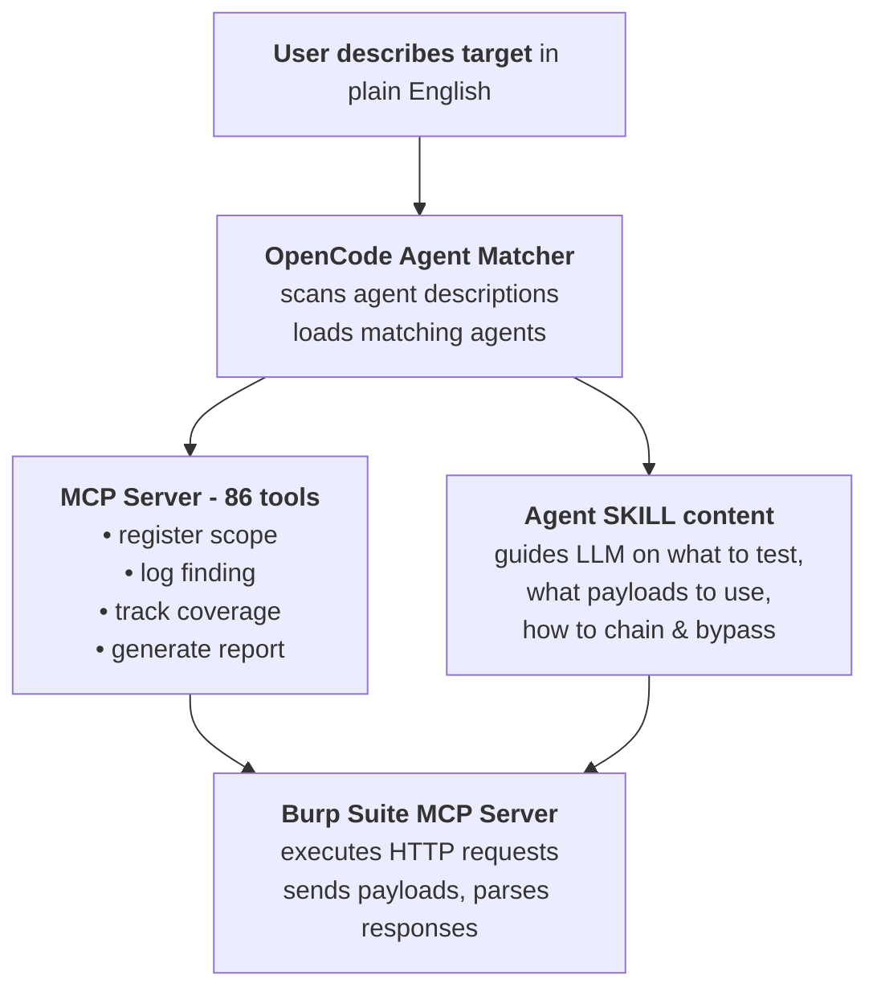
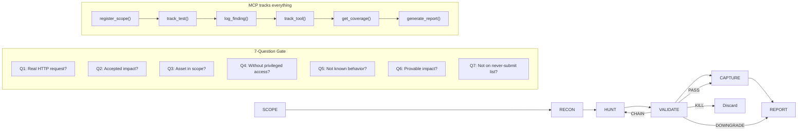
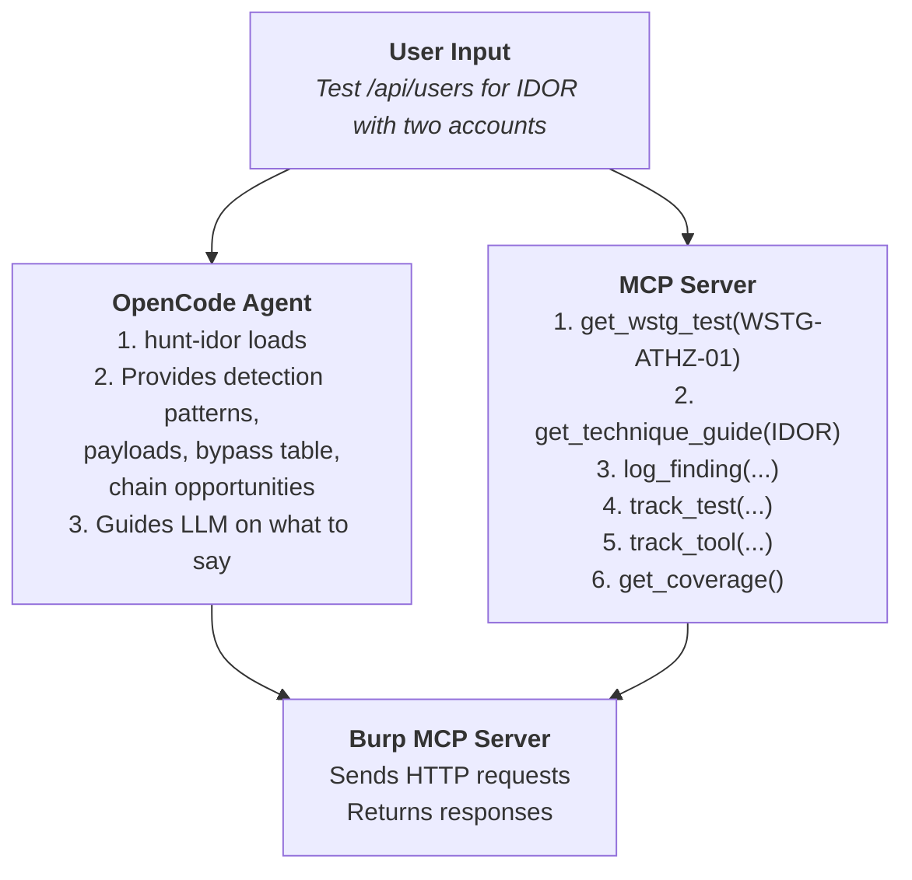
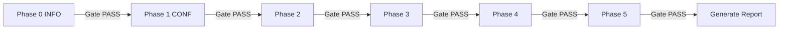

# Workflow — How Dristi Works

## What Dristi Is

Dristi is a security testing platform with two interfaces that work together:

1. **MCP Server** (86 tools) — provides the OWASP WSTG methodology, engagement management, findings database, phase gates, and reporting as callable tools
2. **OpenCode Agents** (73 agents) — provides per-class bug hunting tradecraft. All agents are accessed via `@agent-name` (no `/commands`).

Together they turn an LLM into a methodical bug hunter: the agents tell it *what to look for and how*, the MCP server gives it the *structured methodology and tracking*, and Burp Suite provides *HTTP request execution*.

---

## Working Principle



The loop: **describe → agent loads → MCP tracks → Burp executes → analyze → log finding → validate → report**

All agents are invoked via `@agent-name`. 8 pipeline agents on Tab: `@autopilot` → `@scope` → `@recon` → `@surface` → `@hunt` → `@capture` → `@validate` → `@report`. 48 specialized `@hunt-*` agents + 18 non-hunt agents (74 total) available via `@`.

**Two modes:**
- **`@autopilot`** — runs P1–P7 fully autonomous, ends with report + PoC for submission
- **Manual `@scope` → `@recon` → ...** — interactive, prompts at each phase transition

---

## The 6-Phase Engagement Workflow

Every engagement follows the same 6-phase loop. At each phase, different agents auto-load and different MCP tools become relevant.



---

### Phase 1: SCOPE

**Goal:** Understand the target, define what's in/out, scaffold the engagement.

| What happens | Which agents load | Which MCP tools to use |
|-------------|-------------------|----------------------|
| Parse program rules, identify in-scope assets, OOS items, bounty bands | `@scope`, `@bug-bounty`, `@osint-methodology` | `load_engagement_config()`, `register_scope()`, `get_scope()` |

**How it works:**
1. Invoke `@scope` and answer the prompts
2. `@bug-bounty` agent provides program rules methodology
3. Use MCP to register domains: `register_scope('meta.com', 'app')`
4. Define engagement config via YAML or manually
5. Output: populated `scope.md` with in-scope assets, OOS items, focus areas

**MCP tools used:** `load_engagement_config`, `register_scope`, `get_scope`, `get_engagement_config`

---

### Phase 2: RECON

**Goal:** Discover attack surface — subdomains, endpoints, technologies, secrets, identity fabric.

| What happens | Which agents load | Which MCP tools to use |
|-------------|-------------------|----------------------|
| Subdomain enumeration, endpoint mapping, JS analysis, technology fingerprinting | `@recon`, `@web2-recon`, `@offensive-osint`, `@osint-methodology` | `track_tool()`, `prioritize_endpoints()`, `parse_tool_output()` |

**How it works:**
1. Tell the LLM: *"Run recon on *.meta.com — subdomains, endpoints, S3 buckets."*
2. Agent suggests commands: `subfinder -d meta.com`, `httpx -l subdomains.txt`, `katana -u https://meta.com`
3. You run commands in another terminal, paste results back
4. LLM analyzes results, identifies technologies, ranks attack surface
5. Use MCP to track: `track_tool('subfinder', 'run', 'found 47 hosts')`
6. Use MCP to parse output: `parse_tool_output('nuclei', raw_text)`
7. Output: ranked attack surface with tech stack, priority endpoints

**MCP tools used:** `track_tool`, `parse_tool_output`, `ingest_tool_file`, `prioritize_endpoints`, `get_priority_queue`, `verify_tool_result`

---

### Phase 3: HUNT

**Goal:** Test for specific vulnerability classes using per-class tradecraft.

| What happens | Which agents load | Which MCP tools to use |
|-------------|-------------------|----------------------|
| Active testing with payloads, bypass techniques, chain templates | Invoke `@hunt` or directly use `@hunt-*` agent for the target class | `log_finding()`, `get_wstg_test()`, `get_technique_guide()`, `get_test_payloads()`, `get_witness_payloads()`, `get_waf_bypass()`, `create_exploitation_queue()` |
| **Structured walkthrough** — `@hunt` dispatches to relevant subagents | `@hunt` asks which classes to test, then dispatches to `@hunt-*` subagents | `track_test()` per WSTG-ID, `log_finding()`, `get_coverage()`, `phase_gate_check()` |

**How it works:**
1. Describe what you're testing: *"I see /api/users/{id} with a numeric ID — testing IDOR"*
2. `hunt-idor` agent loads automatically
3. Agent provides:
   - Detection patterns (method swap, array wrap, parameter pollution)
   - Payloads to try
   - Bypass techniques
   - Chain opportunities (IDOR + CSRF = account takeover)
4. Use Burp MCP or curl to send requests
5. If blocked by WAF: `get_waf_bypass('cloudflare', 'idor')`
6. If evidence needed: `get_witness_payloads('url_param')`
7. If finding found: `log_finding('hunt-idor', 'IDOR in /api/users/{id}', severity)`
8. For systematic testing: `create_exploitation_queue('idor', vulnerabilities_list)`
9. Output: confirmed or eliminated leads, logged findings

**How agent auto-loading works at this phase:**

| You say… | Agent loads |
|----------|-------------|
| "XSS on the search field — reflected, stored, DOM contexts" | `hunt-xss` |
| "URL param accepts http:// URLs — testing SSRF" | `hunt-ssrf` |
| "SQLi on the login — testing error, blind, time-based" | `hunt-sqli` |
| "SSTI on template param — Jinja2/Twig/Freemarker" | `hunt-ssti` |
| "CMDI on ping param — testing blind and OOB" | `hunt-rce` |
| "IDOR in /api/users/{id} — cross-tenant access" | `hunt-idor` |
| "Auth bypass on admin panel — path traversal" | `hunt-auth-bypass` |
| "ATO on session — JWT manipulation, 2FA bypass" | `hunt-ato` |
| "GraphQL at /graphql — introspection, mutations" | `hunt-graphql` |
| "File upload on /profile/avatar — RCE via upload" | `hunt-file-upload` |
| "Race condition on coupon — concurrent redemption" | `hunt-race-condition` |
| "OAuth login — CSRF, redirect_uri, state bypass" | `hunt-oauth` |
| "CORS misconfiguration — credentialed cross-origin" | `hunt-cors` |
| "XXE in XML upload — OOB entity exfiltration" | `hunt-xxe` |
| "CSRF on email-change endpoint" | `hunt-csrf` |
| "Prototype pollution in JSON parser" | `hunt-dom` / `hunt-nodejs` |
| "NoSQLi on JSON login endpoint" | `hunt-nosqli` |
| "LDAP injection on search endpoint" | `hunt-ldap` |
| "Open redirect in ?next= parameter" | `hunt-open-redirect` |
| "H2C smuggling on HTTP/2 endpoint" | `hunt-http-smuggling` |
| "Deserialization in session cookie" | `hunt-deserialization` |
| "Subdomain takeover — CNAME unclaimed" | `hunt-subdomain` |
| "Email security — SPF/DMARC spoof feasibility" | `offensive-osint` |
| "Cloud IAM — AWS/Azure/GCP privilege escalation" | `cloud-iam-deep` |
| "M365 tenant — Entra ID, federation, SharePoint" | `m365-entra-attack` |
| "Android APK — decompile, secrets, endpoints" | `apk-redteam-pipeline` |
| "iOS IPA — binary analysis, URL schemes" | `apk-redteam-pipeline` |
| "Smart contract audit — Solidity reentrancy" | `web3-audit` |
| "Token audit — honeypot, liquidity, rug-pull" | `meme-coin-audit` |

**MCP tools used:** `get_wstg_test`, `get_test_payloads`, `get_technique_guide`, `get_witness_payloads`, `get_evidence_checklist`, `get_slot_types`, `log_finding`, `create_exploitation_queue`, `validate_exploitation_queue`, `get_exploitation_queue`, `get_waf_bypass`, `identify_waf`, `track_test`, `add_graph_node`, `add_graph_edge`

---

### Phase 4: VALIDATE

**Goal:** Decide whether a lead is a real, reportable bug before writing anything.

| What happens | Which agents load | Which MCP tools to use |
|-------------|-------------------|----------------------|
| Run the 7-Question Gate on every candidate finding | `@validate`, `@triage-validation` | `track_test()`, `validate_poc()` |

**How it works:**
1. Before drafting any report, invoke `@triage-validation`
2. The `triage-validation` agent runs the 7-Question Gate:

```
Q1: Can an attacker use this RIGHT NOW with a real HTTP request?
Q2: Is the impact on the program's accepted-impact list?
Q3: Is the asset in scope?
Q4: Does it work without privileged access an attacker can't get?
Q5: Is this not already known or documented behavior?
Q6: Can impact be proved beyond "technically possible"?
Q7: Is this not on the never-submit list?
```

3. **Outcomes:**
   - **PASS** — all 7 ✓ → proceed to Capture and Report
   - **DOWNGRADE** — Q2 or Q5 fails → lower severity, still report
   - **CHAIN REQUIRED** — needs another primitive → go back to Hunt
   - **KILL** — any other failure → discard, do not draft

4. Only PASS or DOWNGRADE should result in a report
5. Output: verdict for each candidate finding

---

### Phase 5: CAPTURE

**Goal:** Capture evidence with proper hygiene — redact cookies, PII, sanitize HAR files.

| What happens | Which agents load | Which MCP tools to use |
|-------------|-------------------|----------------------|
| Screenshot hygiene, HAR sanitization, evidence organization | `@capture`, `@evidence-hygiene` | `update_finding()` |

**How it works:**
1. Before screenshots: *"I'm about to capture PoC screenshots. What do I redact?"*
2. `evidence-hygiene` agent loads and provides:
   - Cookie redaction protocol (which fields to hide)
   - PII black-bar rules (other users' data, faces, emails)
   - HAR sanitization (jq filters)
   - Screenshot capture order (request → response → full chain)
3. Capture evidence, sanitize, organize
4. Use MCP to update findings with evidence references
5. Output: sanitized evidence pack ready for report

**MCP tools used:** `update_finding`

---

### Phase 6: REPORT

**Goal:** Draft a submission-ready report using platform-specific templates.

| What happens | Which agents load | Which MCP tools to use |
|-------------|-------------------|----------------------|
| Draft report body, map to VRT, include severity request | `@report`, `@report-writing`, `@bugcrowd-reporting`, `@redteam-report-template`, `@redteam-mindset` | `get_coverage()`, `get_tool_coverage()`, `generate_report()` |

**How it works:**
1. Invoke `@report` or describe the finding
2. Agent loads the appropriate template based on platform:
   - **HackerOne** — standard body format
   - **Bugcrowd** — VRT mapping, severity request paragraph, OOS rebuttals
   - **Immunefi** — smart-contract vulnerability format
   - **Red Team** — client-facing deliverable with DOCX packaging
3. Agent fills in the template with:
   - Vulnerability description
   - HTTP request/response evidence
   - Impact analysis
   - Remediation recommendation
   - CVSS 3.1/4.0 score
4. Use MCP to check coverage: `get_coverage()` → `get_tool_coverage()`
5. Generate final report: `generate_report()`
6. Output: copy-paste-ready report or markdown deliverable

**MCP tools used:** `get_coverage`, `get_tool_coverage`, `generate_report`, `get_findings`, `get_engagement_status`

---

## How MCP Server and Agents Interact

The two interfaces complement each other throughout the workflow:



**At every phase, the pattern is the same:**

1. You describe what you're doing → agent loads with relevant tradecraft
2. Agent guides the LLM on what to test, what payloads to use, how to interpret responses
3. MCP server provides structured methodology (WSTG tests, technique guides) and tracking
4. Burp MCP executes the actual HTTP requests
5. Findings are logged via MCP, tracked via MCP, reported via MCP

---

## Complete Example Walkthrough

### Target: meta.com (bug bounty program)

```
Step 1 — SCOPE
  You: "Testing meta.com for their HackerOne program. Here's the scope."
  → Agent: bb-methodology loads
  → MCP: load_engagement_config('meta'), register_scope('meta.com')
  → Result: scope populated, rules understood

Step 2 — RECON
  You: "Find all subdomains and live hosts for *.meta.com"
  → Agent: offensive-osint loads, suggests subfinder + httpx + katana
  → You run commands, paste results
  → LLM identifies: api.meta.com (GraphQL), auth.meta.com (OAuth),
    admin.meta.com (403), cdn.meta.com
  → MCP: prioritize_endpoints() → {api: 9, auth: 7, admin: 8, cdn: 3}
  → MCP: track_tool('subfinder', 'run', '47 hosts found')

Step 3 — HUNT
  You: "api.meta.com has a /api/users/{id} endpoint. Testing IDOR."
  → Agent: hunt-idor loads with 26 H1 report patterns
  → Tries: PUT /api/users/123 (method swap → 200), 
           /api/v2/users/123 (path traversal → 200),
           {"id":123} (JSON wrap → shows other user's data)
  → MCP: log_finding('IDOR', 'high', '/api/users/{id} allows cross-tenant access')
  → MCP: track_test('WSTG-ATHZ-01', 'completed', 'IDOR confirmed')

Step 4 — VALIDATE
  You: @triage-validation
  → Agent: triage-validation runs 7Q gate
  → Q1: Real HTTP request? ✓ (curl with cookie)
  → Q2: Accepted impact? ✓ (data exposure)
  → Q3: In scope? ✓ (api.meta.com in scope)
  → Q4: No admin-only? ✓ (works with user accounts)
  → Q5: Not known? ✓ (no public disclosure)
  → Q6: Concrete impact? ✓ (victim data returned)
  → Q7: Never-submit? ✓ (not on list)
  → Result: PASS

Step 5 — CAPTURE
  You: "About to screenshot the IDOR PoC"
  → Agent: evidence-hygiene loads
  → Redacts cookies, masks victim email in response
  → Captures: request in Burp Repeater → response with data → curl terminal

Step 6 — REPORT
  You: @report
  → Agent: report-writing loads with H1 template
  → MCP: get_coverage() → 40% (Phase 3 only), get_findings() → 1 finding
  → Template filled: IDOR in /api/users/{id}
  → Output: copy-paste-ready HackerOne report
```

---

## Phase Gate System

After each phase, run `phase_gate_check()` to verify quality before proceeding:



Each gate checks:
- Required tests completed
- Required tools run
- Findings properly logged
- Evidence collected
- No critical gaps

---

## Key Design Principles

1. **Validate before drafting** — the 7-Question Gate prevents wasted effort on N/A findings
2. **Agents auto-load by topic** — you don't need to know agent names, just describe what you see
3. **MCP tracks everything** — findings, tests, tools, coverage — nothing gets lost
4. **Evidence hygiene by default** — redact before capture, not after
5. **Phase gates ensure quality** — don't skip to reporting without coverage validation
6. **Burp is optional** — curl + browser works fine for most testing
